# KSVD 接入下游分类：全路线实验整理

> 整理日期：2026-08-23
> 范围：从合成机制验证到 MolHIV 最终评估，涵盖所有下游分类实验
> 阅读方式：每个实验都回答三件事——**要回答什么问题、怎么做的、结果说明了什么**。没有接触过本课题的人，可以只看每个实验的「一句话结论」快速串起全貌。

---

## 背景：这条路线在做什么

**课题目标**：能不能用无监督 KSVD 从图里自动学出一套「结构字典」（类似自动发现的 motif），把这套字典当成额外特征喂给图分类器，从而提升分类效果？

整条路线沿着一条主线逐层推进，每一层都会先问"能不能做"再问"有没有用"：

```
① 采样：能否把图的局部结构（patch）采出来（1-hop / 随机游走 / Beam8）
② 字典：能否无监督学到有用的结构字典（KSVD vs 随机/PCA）
③ 编码：能否把每个节点的局部结构变成稀疏码 token
④ 融合：token 能否注入分类器（GINE）提升准确率
⑤ 泛化：valid 上的提升能否迁移到 test / 新数据集
```

下面是每步的实验证据。

---

## 路线全景图

```mermaid
flowchart LR
    subgraph P0["Phase 0: 合成机制验证 (Jul 23-24)"]
        A1["C4 vs C8<br/>B0~0.85, RW~1.0 ✅"]
        A2["Distant triangle<br/>B0=1.0, RW 更差 ❌"]
        A3["共享字典 vs 每图独立<br/>0.55→0.86 ✅"]
        A4["CoverageRW 图级闭环<br/>91.0% ✅"]
        A5["RF 曲线<br/>L=8,m=8→c4_hit=0.99 ✅"]
    end

    subgraph P1["Phase 1: 图级 standalone (Jul 25)"]
        B1["KSVD vs random/PCA<br/>0.712 vs 0.685, 5/5 ✅"]
        B2["设计消融 n6k<br/>coverage+max+A8T2 有效 ✅"]
    end

    subgraph P2["Phase 2: 图级 residual (Jul 25)"]
        C1["GINE residual<br/>+0.002, 4/5 wins, 高方差 ⚠️"]
        C2["结论: 图级向量太粗糙<br/>→ 转向节点级"]
    end

    subgraph P3["Phase 3: 节点级 token (Jul 26)"]
        D1["节点级 MUTAG<br/>93.6% vs 广播 83.5% ✅"]
        D2["MolHIV 冻结配置<br/>r=2, D=32, T=3, h64/l3"]
        D3["融合消融<br/>gate > concat > residual"]
        D4["容量扩展<br/>加深/加宽/大字典 全部 ❌"]
    end

    subgraph P4["Phase 4: 冻结终端评估 (Jul 26)"]
        E1["Official-valid<br/>+0.025, 3/5 wins ✅"]
        E2["Official-test<br/>-0.001, 2/5 wins ❌"]
        E3["Valid-test mismatch<br/>Pearson r=-0.534 ❌"]
        E4["参数效率<br/>43,655 vs CIN 138,385 ✅"]
    end

    subgraph P45["Phase 4.5: KSVD 参与路由 (Jul 26-29)"]
        L1["Motif-slot incidence<br/>+0.0037, 6/9 wins ⚠️"]
        L2["Atom-occurrence 二部<br/>二部传播有用, KSVD<real patch ❌"]
        L3["GNN-free prototype MIL<br/>超 GINE, 但非 KSVD-specific ⚠️"]
        L4["Task-adapted 字典<br/>random 反而更强 ❌"]
        L5["背景+见证双字典<br/>全 fold 超 GINE, 但非 KSVD 普遍 ⚠️"]
        L6["Occurrence GINE<br/>加消息传递反而有害 ❌"]
    end

    subgraph P5["Phase 5: 从零探索 / IMDB (Jul 30 - Aug 1)"]
        F1["E0: 数值稀疏恢复 ✅"]
        F2["E1: 固定槽位结构 basis<br/>T1 PASS, T2 初始化敏感 ⚠️"]
        F3["G0: 隐式 motif 发现<br/>PASS_INITIALIZER_ONLY ⚠️"]
        F4["U0: 无人工词表<br/>WALK 表示信号 ✅"]
        F5["U1: 下游 added value<br/>信号存在, 增量 FAIL ❌"]
        F6["IMDB R0: reconstruction ✅<br/>downstream ❌"]
        F7["n-hop sampler FAIL ❌"]
        F8["R0-C: 统计条件 residual<br/>recon ✅, utility ❌"]
        F9["R1: Basis 表征<br/>continuous basis, 非可命名 motif"]
    end

    subgraph P6["Phase 6: luyin14 路线闭环 (Aug 12-14)"]
        G1["补边 EDGE100<br/>全数据集负, 默认 FAIR95 ❌"]
        G2["关系 binding<br/>仅 IMDB-BIN +1.1pt, 未跨集 ❌"]
        G3["节点特征融合<br/>MUTAG/PTC 均未超 feature ❌"]
        G4["Rich readout<br/>FINAL>INIT 未通过 ❌"]
        G5["Structured pursuit<br/>全部 gate 失败 ❌"]
        G6["RAW relation<br/>TRUE 不超 SHUFFLED ❌"]
        G7["节点级 FiLM<br/>MUTAG +0.091(2/3), PTC ❌"]
        G8["OOF 多视图融合<br/>无稳定互补性 ❌"]
        G9["联合多视图字典<br/>未通过 Stage A ❌"]
        G10["Patch-local 多模态<br/>无稳定增益 ❌"]
        G11["Edge-aware 联合<br/>seed0 强, 9-fold 不稳 ⚠️"]
        G12["TUD 外部验证<br/>Mutagenicity 9-fold FAIL ❌"]
        G13["NCI1 radius-2<br/>+5.0pt(8/9), FINAL=INIT ⚠️"]
        G14["Beam8 TU 终局<br/>6 gates 全失败 ❌"]
        G15["ENZYMES/BZR/COX2/DHFR<br/>均不晋级 ❌"]
    end

    subgraph P7["Phase 7: 导师真实子图 Beam8 (Aug 4-17)"]
        H1["Beam8 连续覆盖<br/>edge_cov=0.873 ✅"]
        H2["Rooted canonical<br/>stability=1.0 ✅"]
        H3["分组 KSVD 重构<br/>6/6 branches 通过 ✅"]
        H4["关系 token<br/>FINAL>SHUFFLED 仅 1.08% ❌"]
        H5["Patch Transformer<br/>TRUE>BAG 1.08%, 未超 SHUFFLED ⚠️"]
        H6["Slot-bridge Transformer<br/>TRUE>SHUFFLED 11.78% ✅"]
        H7["MolHIV 槽位桥<br/>重构极有效, 分类不超无桥 ❌"]
    end

    subgraph P8["Phase 8: MolHIV Beam8 (Aug 15-16)"]
        I1["Beam8 路线关闭<br/>incidence 不超 shuffled ❌"]
        I2["Bond-endpoint 节点级<br/>structure_context 略高 ⚠️"]
        I3["CIN Beam8 全量训练<br/>auxiliary 不超 CIN ❌"]
        I4["剩余路线终局<br/>NO_STABLE_ROUTE ❌"]
    end

    subgraph P9["Phase 9: MolHIV 属性感知 (Aug 17-23)"]
        J1["Chemistry relation audit<br/>关系有信号, 分类不增 ❌"]
        J2["双层内容/关系 KSVD<br/>不超主成分 ❌"]
        J3["共享支持字典<br/>机制通过, 分类不增 ❌"]
        J4["条件异常字典<br/>残差不增分类 ❌"]
        J5["MolHIV 全量 RAW Beam8 gate<br/>CIN 强基线, 执行中 🔄"]
    end

    subgraph P10["Phase 10: MolPCBA (Aug 20)"]
        K1["局部化学变化<br/>部分任务有方向信号 ⚠️"]
        K2["KSVD 压缩<br/>输给主成分, 不迁移 ❌"]
        K3["多任务字典<br/>93→60 接近随机 ❌"]
    end

    P0 --> P1 --> P2 --> P3 --> P4
    P0 ---> P5
    P4 --> P45 --> P5
    P4 --> P6
    P45 --> P6
    P5 --> P6
    P6 --> P7
    P7 --> P8
    P7 --> P9
    P8 --> P9
    P9 --> P10
    P6 --> P10
```



> 图例：🟢 成立/有效 · 🟡 部分成立/有信号但不够稳 · 🔴 失败/无效 · 🔵 核心概念

---

## Phase 0：合成机制验证（2026-07-23 ~ 07-24）

**这阶段在问**：在完全可控的合成图上，先证明「随机游走(RW)采样 + KSVD 字典」这套机制在原理上成立，再考虑真实数据。不涉及真实分类。

### 0.1 基础管道烟测（stage0/stage1）
- **要回答的问题**：采样 → KSVD → 读出 → 分类这条工程链路能不能跑通？
- **怎么做**：合成环+弦图，对比 1-hop(B0)、均匀 RW(B1)、偏置 RW(M0) 三种采样；再做 cycle vs path 二分类和 MUTAG 小数据集分类。
- **结果**：管道全通；但 MUTAG 上 B0/B1/M0+KSVD 都只有 ~0.65，而纯 degree 特征有 0.878。
- **结论**：工程可行，但「仅结构邻接 + 浅 LR」的 KSVD 读出**打不过度特征**。这正好验证了文献里的"公平比较"警告——任务能被简单统计解决时，结构字典没有优势。*（详见 `results/SUMMARY.md`）*

### 0.2 C4 vs C8 环检测
- **要回答的问题**：1-hop 邻域看不到环，RW 能扩大感受野看到环吗？
- **怎么做**：两类图节点数边数完全相同，唯一区别是一类含 C4（四元环）、一类含 C8（八元环）。环上任意节点的 1-hop 邻域只有 3 个点（一条 P3 路径），看不到闭合环。对比 B0(1-hop) 和 B1/M0(RW)。
- **结果**：度特征 0.829，B0+KSVD ~0.85（1-hop 上限），**RW+共享KSVD ~1.0**。
- **结论**：机制成立——**必须感受野 ≥4 个点才能看到环，RW 恰好提供这个感受野**。这是整条路线最强的机制证据。

### 0.3 Distant triangle 负对照
- **要回答的问题**：RW 是不是处处更好？
- **怎么做**：构造"两端各一个三角" vs "同端两个三角"的分类任务。1-hop 星形已经能直接看到三角（3 个邻居互相相连）。
- **结果**：B0 ≈ 1.0，RW 反而掉到 ~0.8-0.95。
- **结论**：**RW 不是万能药**。任务不需要多跳信息时，RW 反而把局部判别信号"涂抹"掉了。这说明 RW 只在「需要多跳感受野」时才有价值。

### 0.4 共享字典 vs 每图独立字典
- **要回答的问题**：字典应该每张图各学一套，还是整个训练集共享一套？
- **怎么做**：最初实现每张图独立学字典，导致"图 A 的原子 1"和"图 B 的原子 1"没有对应关系、跨图系数不可比。在合成三角分类上对比两种做法。
- **结果**：每图独立 ~0.55，**共享字典 ~0.86**。
- **结论**：**共享字典是 KSVD 可用的必要条件**，之后所有实验都默认共享。

### 0.5 CoverageRW 图级闭环
- **要回答的问题**：图级覆盖驱动采样（不逐点游走、控边覆盖率）能不能独立完成分类？
- **怎么做**：CoverageRW 算法——度分层选种子（预算 12 次游走）、node2vec 游走(L=8,m=8)、软降权(边权×0.7)、边覆盖率≥0.95 早停；KSVD(D=12,T=3,共享) + rich 读出 + LR。
- **结果**：C4 vs C8 分类：度基线 82.0%、B0+KSVD 82.0%、**CoverageRW+KSVD 91.0%**。平均只要 ~5.7 次游走就达到 B0 用 14 次才有的覆盖。
- **结论**：图级 RW 采样在闭环分类上真实生效，且覆盖效率高。

### 0.6 感受野曲线（RF curve）
- **要回答的问题**：游走多长(L)多大(m)才够？
- **怎么做**：扫 (L,m) 网格，统计"至少一个 patch 包含 C4 的图比例"。
- **结果**：B0=0.000 → L4,m4=0.325 → L6,m6=0.887 → **L8,m8=0.988** → L12,m10=1.000。
- **结论**：L=8,m=8 是性价比默认点，之后合成/小规模实验沿用。

---

## Phase 1：图级 standalone KSVD on MolHIV（2026-07-25）

**这阶段在问**：机制在合成图上成立后，真实分子数据（MolHIV）上 KSVD 字典是否比随机/PCA 更有用？**注意这里是"图级"——整图采少量 patch 压成一个向量**，还没有到节点级。

### 1.1 KSVD vs random-patch vs PCA
- **要回答的问题**：KSVD 学的字典，是不是比"随便抽几个真实 patch 当字典"或"PCA 低秩投影"更有用？
- **怎么做**：MolHIV official scaffold split；CoverageRW 每图最多 8 个 patch(m=8)，patch 向量化用 524 维 wl_chem_ring；字典 D=8,T=2,KSVD 4 轮；分类用 StandardScaler+LogisticRegression。三种字典来源（KSVD/random-patch/PCA）在**完全相同的 patch 池**上比较，5 个字典种子。
- **结果**：KSVD+rich **0.7121±0.0099**，random-patch+rich 0.6846，**+0.0275，5/5 胜出**；PCA+rich 只有 0.6543；size-only 0.6787。
- **结论**：**KSVD 字典学习确实比随机 patch 和 PCA 学到更有用的结构基底**。但 0.712 远低于分子 GNN(~0.80)，单靠结构通道当不了主分类器——只是"比基线好"，不是"够用"。

### 1.2 设计消融 n6k
- **要回答的问题**：采样、池化、字典大小这些环节里，哪些设计真正有用？
- **怎么做**：6000 图 scaffold 子集、seed 0，逐环节对比（各环节只改一处）。关键对照是**相对 size 基线(0.765)** 而不是 degree(0.605)，因为分子大小本身已经能预测很多。
- **结果**：
  - 池化：**max 0.637 ≫ mean 0.491**；
  - 采样：**coverage 0.637 > B0 0.448**；抬覆盖/关早停反而变差；
  - 字典：**小字典 A8T2 0.702 > A16T3 0.637 > A24 0.619**；
  - 残差检验（相对 size）：A8T2+max+coverage 把 s+size 从 0.765 抬到 **0.803 (+3.7pt)**；但盲目大感受野 L12 反而 -6.1pt。
- **结论**：`coverage 采样 + max 池化 + 偏小字典` 是当前最优组合，结构通道相对 size 有**单 seed 上的 +3~4pt 增益**；但加粗、加大感受野有害。

---

## Phase 2：图级 residual 到 GINE（2026-07-25）

**这阶段在问**：图级 KSVD 向量能不能作为额外输入喂进 GNN 提升分类？

### 2.1 GINE residual
- **要回答的问题**：把图级 KSVD 向量做 residual 拼进 GINE，能涨点吗？
- **怎么做**：8000 图子集、5 个 neural seed；用 seed0 的 8 维 max-activation 结构向量，zero-init residual 头（学习率 = 基线的 0.1）；inner-checkpoint 协议选 epoch。
- **结果**：GINE 0.7585 → +residual 0.7601，**均值 +0.0016（4/5 方向为正，但 seed2 有 -0.0427 的大 outlier）**。
- **结论**：方向多数有益但被一个负 outlier 抵消，统计上打平。根本原因：**图级向量进 GNN 太晚，没法参与中间层的消息传递**——这是「结构信息怎么用」的问题，不是结构信号本身的问题。直接催生了 Phase 3 的节点级改造。

### 2.2 Next-round 多种子验证（B/C/D/A）
- **要回答的问题**：上一轮单 seed 的 +3.7pt 是不是真的？
- **怎么做**：四个方向 B(小字典细扫+多种子 residual)、C(patch 加化学直方图)、D(环偏置采样)、A(节点门控)，3 个 seed。
- **结果**：**B 的 Δ(s+size−size) 跨 seed 正负摇摆，均值≈0**（A8T3 ≈ -0.01±0.04）；C 的 chem ≈ -0.003；D 的 ring_boost=1 最好也是 -0.03；A 的节点门控没稳定超 gine_only。
- **结论**：**单 seed 的 +3.7pt 是假象**。结构通道相对 size 的增益脆弱；图级 concat 基本可判无效。评估必须多种子 + 相对 size，且「图级硬拼结构向量」这条路到头了。

---

## Phase 3：节点级 localized node tokens（2026-07-26）

**这阶段在问**：把每个节点的结构 token 保留在节点层面、随 GNN 一起消息传递，能不能替代粗糙的图级向量？**这是整条路线的关键转折。**

### 3.1 MUTAG 节点级 vs 图级广播
- **要回答的问题**：节点级 token 是否显著优于"全图一个结构向量复制给所有节点"？
- **怎么做**：每个原子取 radius-2 ego patch → KSVD 稀疏码(32维) → 作为节点 token 用 zero-init scalar gate 注入 GINE 每一层。对比：广播（s_G 复制到所有节点）。
- **结果**：节点级 **93.6%**，广播 83.5%，gin_only 94.6%。
- **结论**：**节点级 token 是大突破**——保留"哪个节点激活了哪个原子"的局部对应关系，比图级聚合有效得多，且基本追平纯 GINE。

### 3.2 融合方式消融
- **要回答的问题**：token 怎么注入最好？
- **怎么做**：比较 concat / residual / zero-init global scalar gate / per-node adaptive router。
- **结果**：**gate > concat > residual**；adaptive router 0/3 胜出（-0.015）。
- **结论**：简单 global scalar gate 反而最好——参数少，强制模型学到所有节点共享的结构使用策略；router 自由度太大，容易学到 scaffold-specific 的过拟合用法。

### 3.3 容量扩展 screen
- **要回答的问题**：加宽、加深、加大字典能不能继续涨点？
- **怎么做**：h64/l4(加深)、h80/l3(加宽)、D48/T4(大字典)、adaptive router，全部相对冻结 reference(h64/l3, D32/T3) 比 inner-valid。
- **结果**：加深 -0.0015（方差暴增）、加宽 -0.0187、大字典 **-0.0707（明确失败）**、router -0.0150。全负。
- **结论**：当前小模型**不是 underfit**。更大骨干更容易吸收训练 scaffold 的偶然相关性，放大 valid-test mismatch。之后不再走普通容量路线。

---

## Phase 4：冻结终端评估（2026-07-26）

**这阶段在问**：把 Phase 3 的最优配置冻结，用 5 个 seed 做规范评估，到底在 official valid/test 上什么水平？

### 4.1 Official-valid（5 seed）
- **要回答的问题**：冻结配置在官方验证集上是否稳定优于 GINE？
- **怎么做**：冻结配置 r=2, D=32, T=3, h64/l3, zscore-signed, all-layer zero-init gate。协议：inner-train(85%)选 epoch → 全 official-train 重训 → official-valid 只评估一次。5 个 seed。
- **结果**：KSVD 0.7946 ± 0.0374 vs GINE-h64 0.7700 ± 0.0324，**+0.0246，3/5 wins**；两个 seed 有大幅正增益（+0.074, +0.077）。
- **结论**：valid 上 KSVD 通路包含**真实可利用的结构信号**（不是纯噪声），但 n=5 方差不显著（p=0.35）。

### 4.2 Official-test（5 seed）——关键结果
- **要回答的问题**：valid 上的增益能不能迁移到新 scaffold 的 test？
- **怎么做**：与 valid 完全相同的协议，冻结后对 official-test 评估一次。
- **结果**：KSVD 0.7519 ± 0.0151 vs GINE-h64 0.7527（**-0.0008，2/5 wins**）；vs 参数匹配的 GINE-h70 0.7633（-0.0114）。
- **结论**：**valid 增益在 test 上完全消失甚至转负**。test 上 KSVD 与 GINE 打平，达不到 CIN(~0.81)。这是整条路线最大的挫折点。

### 4.3 5-seed ensemble
- **要回答的问题**：多 seed 概率平均能否救回稳定性？
- **怎么做**：5 个 seed 的正类概率算术平均。
- **结果**：test ensemble：GINE-h70 0.7776、GINE-h64 0.7752、KSVD 0.7704。valid 上 KSVD 0.8286 领先，但 **test 上仍落后 GINE**。
- **结论**：ensemble 有价值（把 KSVD 从 0.752 拉到 0.770），但 GINE 同样受益且 test 更高。KSVD 不能靠 ensemble 反超。

### 4.4 参数效率审计
- **要回答的问题**：作为"参数效率"卖点，KSVD 比 CIN 小多少？
- **怎么做**：官方 CIN 代码复现参数量，与 KSVD 冻结配置对比。
- **结果**：KSVD **43,655 trainable**（+27,136 固定字典 = 70,791 stored）；CIN-small 138,385（3.17×）、CIN h64 239,809（5.49×）、CIN++ 365,377（8.37×）。
- **结论**：参数效率是**真实且幅度不小的优势**。但论文需同时报两种口径（trainable 与含字典的 stored values），否则会被质疑把学习参数藏在预处理里。

### 4.5 Valid-test mismatch 诊断
- **要回答的问题**：为什么 valid 好的模型 test 反而差？
- **怎么做**：分析 5 seed 的 valid-test 相关性与 seed 排名。
- **结果**：**Pearson r = -0.534**（KSVD）。seed2 valid 最高(0.8556) 却 test 最低(0.7365)；seed3 反过来。GINE-h64 甚至 -0.914。
- **结论**：**当前 valid ranking 完全不能用于选部署 seed**。问题不只是 KSVD 特有（GINE 也有），而是单 inner split + 小正例数(185)导致 epoch/seed 选择噪声大 + 训练 scaffold 过拟合。

---

## Phase 4.5：KSVD 参与路由——Motif-slot incidence / 真实原型二部传播（2026-07-26 ~ 07-29）

**这阶段在问**：前面把 KSVD 稀疏码当"side feature"注入 GINE，但容量的路已经走不通了。如果换个思路——**让 KSVD 稀疏码直接定义消息传递拓扑（routing）**，让 atom 通过 KSVD 字典原子相互传递信息，而不是只当普通特征，会不会更好？同时，**真实观察到的局部 patch**（real-patch prototype）和 KSVD 学出的自由方向，到底哪个更适合做分类词表？

这是路线转向的关键分叉：从"把 KSVD code 塞进 GINE"转向"由 KSVD sparse assignment 构造可学习的高阶 incidence topology"。

### 4.5.1 KSVD motif-slot incidence（P0 pilot）
- **要回答的问题**：让每个字典原子 slot 作为一个"motif 节点"，atom 按 sparse assignment 发消息到 slot、slot 再广播回 atom，能不能提升分类？
- **怎么做**：三层 GINE-JK 骨干，layer 1 后插入 atom→dictionary-slot→atom 一轮传播。每个 slot 用 rank-16 bottleneck 更新，zero-init residual gate。3 scaffold folds × 3 seeds，只用 official-train 内部。
- **结果**：GINE 0.71742 vs KSVD motif-slot 0.72112，**+0.0037，6/9 wins**；但 Δ≥+0.005 的确认门槛未过。KSVD 在全部 3 折上胜 shuffled-ID（+0.0085）和 no-ID（+0.0080），也胜 PCA 的 2/3 折（+0.0025）。
- **结论**：**第一次证明 persistent dictionary-atom identity 贡献了超越普通额外消息传递的东西**，但增益还不够大。P0 的 graph-global slot 会让同一分子内远端 occurrence 互相短路，下一步 P1 应拆成 spatially connected motif occurrences。

### 4.5.2 Prototype occurrence graph / occurrence GINE
- **要回答的问题**：构造显式的 occurrence 节点（同一 prototype 的 radius-1 连通分量），在 occurrence 图上做消息传递，比直接把 occurrence 做 MIL 更好吗？
- **怎么做**：frozen local prototypes → 每个 prototype 的 radius-1 连通分量作为 occurrence node → occurrence 边编码共享原子和分子键 → 用 occurrence-level MIL 或一层 occurrence GINE 做分类。**原始节点图上没有监督消息传递**。
- **结果**：occurrence MIL 相对 node MIL 在 fold 1 大幅改善(+0.094)但 fold 0/2 下降，均值 +0.0172(1/3 折)。occurrence GINE 的各种变体（直接 residual / zero-init gate）全部不超 occurrence MIL（均值 -0.0037~-0.0355）。KSVD identity 相对 shuffled 胜 +0.0336(3/3)，但 KSVD occurrence MIL 仍低于 random real-prototype occurrence MIL（-0.0157）。
- **结论**：**occurrence 是有价值的中间对象**（能修复 fold 1 的失败），但在这个对象上强加消息传递反而有害；KSVD identity 有信号，但不如真实 observed prototype。

### 4.5.3 Atom–occurrence 二部传播（无 GNN 路线）
- **要回答的问题**：完全去掉 GINE，只做两轮 atom→occurrence→atom 受限传播，能不能超过 node-level MIL？
- **怎么做**：0 层 GINE。PCA64 降维 → 32 个 farthest real-patch prototypes → top-3 assignment → 两轮 atom→occurrence→atom 传播 → atom/occurrence 分别 attention + mean + max 读出。对比：KSVD方向 / PCA / random direction / random real-patch / shuffled-ID / no-ID。
- **结果**：二部传播相对 node MIL 有增益（farthest +0.0168, 2/3；KSVD +0.0242, 2/3）。**但 KSVD 二部 0.7291 仍低于 farthest real-patch 二部 0.7363（-0.0071）**。KSVD 胜 PCA(+0.0306)、random direction(+0.0227)、shuffled-ID(+0.0951)、no-ID(+0.0250)，但**输给最简单的真实 patch 原型**。
- **结论**：**通过首轮验证的是"真实局部 occurrence 的受限二部传播"，不是"KSVD 二部优于 matched alternatives"**。KSVD 不是这套二部架构中最好的局部词表。

### 4.5.4 GNN-free raw-patch PCA prototype MIL（3×3 确认）
- **要回答的问题**：完全去掉 GNN，只靠 radius-2 raw patch + PCA64 + 32 个真实 prototype + node-level MIL，效果如何？
- **怎么做**：3 scaffold folds × 3 seeds，fixed 30 epochs。对照：random real-patch project MIL vs KSVD-direction MIL vs fixed-epoch GINE。
- **结果**：random real-patch MIL grand mean 0.7354，KSVD-direction MIL 0.7245，Δ = +0.0109（6/9 wins）。**无 GNN 的 random prototype MIL 以 +0.0379(9/9) 超过 fixed-epoch GINE(0.6975)**，甚至以 +0.0180(8/9) 超过对 GINE 有利的 best-heldout-epoch 参考(0.7174)。
- **结论**：**三层 GINE 作为 KSVD 的自然中心架构是合理的基线，但不是唯一的——无 GNN 的 real-prototype MIL 已经能稳定超过 GINE**。这对 KSVD 路线是双刃剑：证明了"字典/原型视图"的竞争力，但同时也说明 KSVD 的自由方向不如真实观察到的 patch identity。

### 4.5.5 Prototype-constrained task-aware MIL
- **要回答的问题**：用图标签来选择字典原子（任务感知选择），是否更好？
- **怎么做**：256 个候选真实原型 → 图级 occurrence 特征 + logistic rank + MMR 多样性约束 → 选出 32 个 task-aware 原型 → 分类器。对照：随机 / farthest / task-aware / label-shuffled / KSVD directions。
- **结果**：task-aware 0.7056 低于 random 0.7310（-0.0254, 1/3 wins），甚至低于 label-shuffled 0.7373（-0.0318, 0/3 wins）。选择器的 fit AUC 0.918-0.926，但 shuffled-label 也到 0.830-0.871（直接证据：高维选择器在单 split 上拟合标签噪声和 scaffold 偶然性）。
- **结论**：**任务信号应该进入 occurrence weighting/readout 层，而不是直接用图标签监督 dictionary atom identity**。用分子级标签粗暴分配到局部 patch 会产生严重的 credit-assignment 错误。

### 4.5.6 KSVD-JK 固定双分支 ensemble
- **要回答的问题**：GINE-JK 与 KSVD graph-residual 的固定 0.5/0.5 概率平均，能否稳定提升？
- **怎么做**：两个分支独立训练、各自选 epoch，概率等权平均。n=8000, 3 seeds, inner-only。
- **结果**：inner mean 0.7852（相对 GINE-JK +0.0094, 2/3 seeds）。0.5/0.5 ensemble 在 3 seeds 上均超两个单分支。full-inner 3 seeds：0.8270 vs GINE-JK 0.8208。official-valid 3 seeds：0.8012 vs GINE-JK 0.7930（+0.0082）。
- **结论**：**方案可行，主要价值是两分支稳定性互补**。但 post-hoc 对照显示两 GINE-JK 不同 seed ensemble 也差不多，不能证明 KSVD-specific 增益。且 valid 0.801 没迁移到 test（test 0.762）。

### 4.5.7 Atom-conditioned additive readout
- **要回答的问题**：用 `|z_vj|` 把同一个 GINE node state 分配到字典原子 slot，能不能替代第二个 GINE 分支？
- **怎么做**：只执行一次 GINE-JK，每个 atom 权重分配到 32 个字典原子，再汇总成图级 logit。仅增加 96 参，atom weights 初始为零。
- **结果**：固定 split 上 KSVD 0.7940 高于 GINE-JK 0.7758 和 PCA 0.7833。但换 3 个 inner split 后，KSVD 每次低于 GINE，且 KSVD 与 PCA 的 split mean 几乎相同（差 -0.00009）。per-atom 独立方向版本（+2048 参）仍比 GINE 低。
- **结论**：**basis-conditioned additive readout 工程可行，但没证明 KSVD-specific 增益**。不进入 official-valid/test。

### 4.5.8 稳定真实原型 full official evaluation
- **要回答的问题**：GNN-free real-prototype MIL 扩展到全量 41,127 图，能否与 GINE 竞争？
- **怎么做**：3 个 graph-balanced 256-patch bank → 各无标签抽 32 个 observed real patches → 3-bank 概率 ensemble。frozen 30 epochs。
- **结果**：prototype ensemble valid 0.8025 / test 0.7678；GINE ensemble valid 0.7814 / test 0.7780。prototype 在 valid 上比 GINE 高 +0.021，但 test 上低 -0.010。
- **结论**：**真实局部 patch vocabulary 是有效且有竞争力的分支**，但不能声称超过 GINE，且**不是 KSVD-specific 的增益**（最终分类器用的是 PCA metric + observed patches，不是 KSVD directions）。

### 4.5.9 真实原型 exact-distance 关系分析
- **要回答的问题**：两个 prototype 在距离 1/2 内的共现组合，是否携带 occurrence 之外的额外信息？
- **怎么做**：固定 farthest 和 scaffold-facility 两种真实原型词表，统计距离 1/2 内的具体结构组合，用 covariance PCA 压缩到 144 维（不看标签，只看训练分子中反复共同变化的组合）。
- **结果**：full official-train 3 折：covariance PCA 0.7827 vs compact base 0.7795，**+0.0032，3/3 折通过**。real − assignment-shuffled +0.0022(2/3 折)。correlation PCA 只有 +0.0009。
- **结论**：**真实结构组合的 covariance PCA 通过全部 4 项预注册门槛**，说明距离 1/2 内的具体结构组合确实补充了弱信息。但增益小（+0.003），且依赖 covariance 而非 random projection。

### 4.5.10 真实原型 compact relation official test
- **要回答的问题**：compact relation（occurrence + exact-distance 关系）在 official test 上如何？
- **怎么做**：冻结配置，official test 评估一次。farthest + scaffold_facility 各 32 原型，uniform gate，top-3 分配，exact distance 1/2 compact relation。
- **结果**：compact real test 0.7515，occurrence ensemble 0.7421，**compact real 相对 occurrence +0.0093**（bootstrap 95% CI 不含 0）。但 **compact real − assignment-shuffled = -0.0006**（不可区分）。
- **结论**：compact 附加统计量可能有用，但具体原型身份间的配对关系不能证明是增益来源。valid 的 0.812 高估了 terminal test。

### 4.5.11 Task-adapted dictionary-primary MIL
- **要回答的问题**：让字典本身用图标签做任务适配（task-adapted KSVD），能否超过 frozen KSVD 和 random 对照？
- **怎么做**：GNN-free（0 层监督消息传递），32-atom 字典从 KSVD/random/PCA 初始化，可微 top-3 迭代硬阈值更新，任务损失 +0.1 重建 +0.1 anchor。图标签只监督图输出，不复制到 patch。
- **结果**：seed-0 时 adapted KSVD 0.7139 相对 frozen KSVD +0.0065(3/3)；但 **adapted random 0.7286 在全部 3 折上胜过 adapted KSVD（+0.0147）**。3×3 稳健性：adapted−frozen 仅 +0.0007(5/9)，frozen random−frozen KSVD +0.0134(8/9)。
- **结论**：任务适配本身不产生 KSVD-specific 增益。审计发现：random atoms 是真实 observed 原型（nearest cosine 0.997），KSVD atoms 是合成重建方向（0.845）——**对 graph-label MIL，原型保真度比全局重建覆盖更重要**。

### 4.5.12 GNN-free 无 GNN 路线在 official split 上的终局
- **要回答的问题**：开发折上"无 GNN 的 prototype MIL 能超 GINE"，在 official valid/test 上还成立吗？
- **怎么做**：8000 图分层子集、保留 OGB official 归属（train 6400 / valid 800 / test 800），frozen 30 epochs，3 seeds。
- **结果**：GINE ensemble valid 0.7463 / test 0.7238 最好；random prototype MIL test 0.7006（-0.0231）；KSVD-direction MIL test 0.6777（-0.0460）。random 仍超 KSVD（-0.0229）。
- **结论**：**开发折的胜利没有迁移到 official split**。GNN-free 路线不是死路但有差距；KSVD 比 random 稳定（test std 0.020 vs 0.074）但始终更低。

### 4.5.13 节点特征驱动的 occurrence GNN（两阶段浅架构）
- **要回答的问题**：原始原子/键特征先进一层轻量消息传递，再按 prototype 组成 occurrence、在 occurrence 间传一次，能否让局部片段真正"看见"化学信息？
- **怎么做**：`atom1_occ_gnn` = 一层原子 GINE + 一层 occurrence GINE，5 个匹配消融。prototype 身份是否注入作为关键对照。
- **结果**：`atom1_occ_gnn` 0.7213 相对直接原子池化 **+0.0441（3/3 折）**；删除 prototype 身份掉 **-0.0659（3/3 折）**。但单个模块单独用都无效（atom1_occ_mil -0.0225、atom0_occ_gnn -0.0114）——必须两级同时存在才有效。
- **结论**：两级浅架构 + prototype 语义身份是有机制意义的分支，但绝对分数(0.7213)仍低于 broad occurrence 强基线(~0.7557)，不进入 official valid/test。

### 4.5.14 背景+见证双字典（background+witness dual-bank）
- **要回答的问题**：如果保留"常见背景"字典，同时用 OOF-MIL 选出的正例见证 patch 学一个"见证"字典，联合 OMP 编码，能否让 KSVD 获得稳定的 GINE 增益？
- **怎么做**：每折用 cross-fitted MIL scorer 从每个正例分子选 top-2 见证 patch（不复制标签），背景字典(D=8)+见证字典(D=8)拼接成 16 原子，联合 T=2 OMP；读出头只加 169 参数。
- **结果**：3 折 × 3 seeds：**KSVD 在每个 fold mean 上都超 GINE（+0.0154/+0.0124/+0.0086，pooled +0.0121，7/9 wins）**；完整 family-specific 对照中 KSVD pooled mean 0.7295 > random 0.7260（+0.0036, 6/9）> PCA 0.7199。fold-2 上 KSVD 相对 PCA +0.0127(3/3)、相对 random +0.0057(3/3)。但 fold-1（最难折）random 反超（-0.0052）。
- **结论**：**这是整条路线里最接近"KSVD-centered GINE 增益"的结果**，但 KSVD 特异性仍非普遍（fold 1 反超），官方 valid/test 保持密封。

### 4.5.15 其他筛选（全部失败或中性）
- **KSVD-guided real medoid**：KSVD 覆盖排序 + 恢复真实原型身份，改进了 KSVD 方向（+0.0082），但输给随机真实原型（-0.0153）。
- **Fixed-vocabulary relation gates**：label-free 关系信号确认存在（+0.0045），但监督 gate 反而不如 uniform gate，且不如 shuffled-label gate。
- **Task-matched relation sidecar**：prototype seed 20260728 通过，但换 seed 20260729 后增益消失，robustness gate 失败。
- **Nested task-matched prototype**：source-clean 修复后 task-aware 只 +0.0033（门槛 +0.005），失败。
- **Path overlap residual**：atom–path 精确重叠的残差传播，不超 path-set 控制。
- **Chemical fragment graph**：BRICS 分解 + 片段图消息传递，true graph 不超 shuffled connection。
- **Sparse-ego / no-ring / SSL-geometry / rich-code / OOF-witness 系列**：无环变体（去掉 13 维 ring 统计后信号仍存在但非 KSVD-specific）、PCA-whitened 指标（+0.0024 但弱于 raw）、SSL latent 上的各种 transport、rich sparse-code residual（random/PCA 反而更强）、witness-only refit（fold-2 崩）、class-conditional witness（-0.005）等全部在 inner-only 被淘汰，无一进入 full-inner 或 official-valid/test。

### 4.5.16 阶段总结
- **真正成立的是"真实局部 occurrence 的受限二部传播"**，它不需要 GINE 就能与 GINE 竞争，且 atom–occurrence incidence 是真实但较弱的结构信号。
- **KSVD identity 比 shuffled 和 no-ID 有用**（motif-slot 胜 +0.0085/0.0080，occurrence GINE 胜 +0.0336/0.0317），但**始终不如最简单的真实观察 patch 原型**（farthest real-patch bank）。
- **"让 KSVD 参与路由"的 incidence 方向有机制依据**（motif-slot 6/9 wins，二部传播 2/3 wins），但增益不够大、不够稳定，且 KSVD 被 real-patch 原型压过，不能作为 KSVD-specific 贡献。
- **路线结论**：不继续沿此方向把 KSVD 当核心词汇；若继续二部路线，应以 farthest real-patch bank 为主体，KSVD 降级为 coverage/residual 侧信息。

---

## Phase 5：从零探索 / IMDB 纯结构（2026-07-30 ~ 08-01）

**这阶段在问**：回到最基本，从零重做一遍：KSVD 实现本身对不对？邻接矩阵适不适合当字典信号？不人工给 motif 词表能不能自学习？真实图上的重建提升能不能转成分类价值？全程只用纯结构（IMDB-BINARY，无节点属性），避免把问题混在一起。

### 5.1 E0：纯数值稀疏恢复
- **要回答的问题**：KSVD 代码实现能不能恢复已知的稀疏字典？
- **怎么做**：已知真字典 D_true，训练/测试 patch 1000/300，T=1 和 T=2，25 次更新，比较 atom cosine、support F1、test 重建。
- **结果**：T1/T2 都达到 test 重建=0、atom cosine=1、support F1=1、**10/10 严格恢复**。
- **结论**：KSVD/OMP 基础实现可工作，为后面所有实验打底。

### 5.2 E1：固定槽位图结构 basis
- **要回答的问题**：把原子定义为固定邻接槽位上的结构基，理想条件下能否恢复？
- **怎么做**：T=1 和 T=2 两种稀疏度，恢复实验。
- **结果**：T=1 是 10/10 恢复 PASS；**T=2 只有 5/10**（mean cosine 0.884）。
- **结论**：**重建接近完美时真原子仍可能没被恢复**。第一次明确"reconstruction 成功 ≠ 结构可辨识"。

### 5.3 E1-init：初始化诊断
- **要回答的问题**：T=2 的失败是目标错位还是局部最优？
- **怎么做**：50 个 learner seeds 诊断。
- **结果**：单启动成功率 29/50；5-start 分组按最低训练误差选择，正确 basin 概率 ~0.991。
- **结论**：是**可管理的局部最优**问题。但多启动依赖不适合真实部署，之后统一改用：**每 fold 一个 deterministic maximin 初始化、restart=0**。

### 5.4 G0：四种隐式 motif
- **要回答的问题**：不给 motif 标签，KSVD 能否恢复人工种下的四种 motif 词表？
- **怎么做**：训练数据只有四种 exact canonical 列；对比 strong INIT 和 random-column INIT。
- **结果**：deterministic maximin INIT 已经 10/10 枚举四种；random-column INIT 是 0/10，但 KSVD FINAL 能拉到 10/10。
- **结论**：只算 **PASS_INITIALIZER_DISCOVERY_ONLY**——强初始化已经完成了"发现"，无法把功劳归给 KSVD updates。

### 5.5 G0B：motif 变体/噪声
- **要回答的问题**：加入噪声边后，"一个 atom 对应固定 motif edge mask"还能辨识吗？
- **怎么做**：在 motif 上加一条 non-core 边或随机 flip，看不同 motif 家族能否产生相同 observed 图。
- **结果**：cross-family collision mass **0.477**（近半冲突）、Bayes accuracy ceiling 0.892、worst robust fixed-core F1 0.591。
- **结论**：对一般 noisy untyped patch，**"atom = 固定 motif mask"的强命题不可辨识**。这推动了"放弃每个 atom 必须是可命名 motif"的要求。

### 5.6 U0-R：表示审计（WALK vs canonical）
- **要回答的问题**：邻接向量坐标适不适合 KSVD 的线性几何（欧氏距离/内积）？
- **怎么做**：60 节点 degree-4 ring lattice 做保持度序列的 rewiring，模型不知道任何 atom 词表。对比 exact rooted canonical adjacency 和 WALK first-discovery order。
- **结果**：canonical 同构不变但**一条边翻转被放大**（Hamming 变化 ~3.26，62% 超线性放大）；WALK 一条固定边翻转只影响 1 个坐标，relabel 不变性=1。
- **结论**：**选 WALK 表示**，canonical 只作 baseline。WALK 保留 sampler-slot 语义，更适合线性字典。

### 5.7 U0-P：确认输入有信号
- **要回答的问题**：训练 KSVD 之前，WALK patch 里到底有没有结构信号？
- **怎么做**：5 个数据 replicate，用 WALK patch 统计量直接做二分类。
- **结果**：WALK mean/std BA 0.815、canonical 0.803、edge histogram 0.826、label shuffle 0.501。
- **结论**：WALK patch 包含可用结构信号（且不是标签泄漏），可以进入字典学习。

### 5.8 U0-D：单 deterministic INIT 字典审计
- **要回答的问题**：不人工给词表、只用一次可部署初始化，KSVD 能否学出健康字典并改善 unseen 重建？
- **怎么做**：d=15, K=12, T=2, u=25，1 个 deterministic maximin，restart=0，5 个 replicate。
- **结果**：held-out 重建相对改善 mean **0.3455（5/5 为正、全超 10%）**；12/12 nondead；max activation share 0.23-0.29（不坍缩）；跨 replicate atom cosine 0.862（INIT 只有 0.551）。
- **结论**：**PASS**。这是整条路线第一个直接证据：无人工词表、单次初始化下 KSVD 能学出健康且改善 unseen-patch 重建的 basis。

### 5.9 U1A：下游信号与 added value
- **要回答的问题**：重建好 = 分类好？KSVD updates 到底有没有"增量"？
- **怎么做**：36-D marginal graph code（每 atom 的激活频率/均值/RMS）接 LR；关键对照是 **FINAL−INIT**（同起点才算 KSVD updates 的功劳）。
- **结果**：STATS 0.935、FINAL code 0.750 > INIT 0.713，但 **FINAL−INIT = +0.037，仅 3/5 为正（门槛要 4/5）**；code shuffle 0.475、label shuffle 0.491。
- **结论**：graph code **有真实信号**（PASS），但 **KSVD update added value 不成立**（FAIL）。同时简单图统计(0.935)碾压所有 code——说明 rewiring 任务主要被低阶统计决定。

### 5.10 IMDB R0-P：真实 substrate
- **要回答的问题**：真实 IMDB 图的 patch 质量够不够？
- **怎么做**：raw IMDB-BINARY（1000 图），先审计 patch 基材：团占比、拓扑多样性、WALK 信号。s=6 失败后只改一个轴到 s=7（不事后改判定）。
- **结果**：s=7：clique mass 0.336、有效拓扑数 18.9、WALK BA 0.619、canonical 0.630、edge hist 0.648、STATS 0.700、label shuffle 0.504。
- **结论**：substrate 与 standalone 信号足够进入字典审计，但 patch 统计还补不上 STATS。

### 5.11 IMDB R0-D：真实字典优化
- **要回答的问题**：真实图上 KSVD 能否稳定改善 held-out patch 重建？
- **怎么做**：s=7, d=21, K=12, T=2, u=25，deterministic maximin，split seed 731301；raw/stratified 和 raw/exact-isomorphism-grouped 两个 5-fold view。
- **结果**：两个 view 都 **5/5 折正**，重建相对改善 0.4787/0.4789；12/12 nondead；train/test gap≈0。
- **结论**：**PASS_R0D**。真实图上重建增益稳定成立（含分组 view，排除同构泄漏）。

### 5.12 IMDB R0-A：下游归因
- **要回答的问题**：重建增益能不能转成 IMDB 分类增益？
- **怎么做**：新 split seed，主比较 STATS+FINAL vs STATS+INIT。
- **结果**：stratified：STATS 0.704 → +INIT 0.680 → +FINAL 0.678（**FINAL−INIT -0.002，2/5 正**）；grouped：0.623→0.624→0.630（+0.006，3/5）。且 stratified 里对齐的 FINAL(0.678) 还**低于打乱版本的 FINAL(0.685)**。
- **结论**：**没有建立稳定 task utility**。重建对分类没有增量，是核心失败的第一次系统确认。

### 5.13 Direct capped n-hop sampler
- **要回答的问题**：失败是不是因为 WALK 采样本身不好？换个 n-hop 采样器会不会好？
- **怎么做**：固定 7 节点的 direct capped n-hop（三种排序：n_id/n_degree/n_signature），对比 WALK。
- **结果**：n-hop 明显更团主导（clique mass 0.559-0.642 vs WALK 0.336）；radius-2 ego 100% 坍缩为整图；n-hop standalone BA 最高 0.647，只比 WALK canonical 高 0.017，STATS+n-hop 仍低于 STATS。
- **结论**：**FAIL**。失败不能简化为"WALK 采样不好"——换采样器不解决。

### 5.14 R0-B：atom-pair readout
- **要回答的问题**：patch 内部原子共现关系（co-activation）能不能补上关系信息？
- **怎么做**：在 36-D marginal 后加 C(12,2)=66 个同 patch support co-activation 特征。
- **结果**：stratified 只 3/5 正，pair added over marginal FINAL = **-0.018**；train 升 test 降（纯加拟合容量）。
- **结论**：**FAIL**。更多 bag 级统计量不解决问题。

### 5.15 R0-X：objective-alignment 诊断
- **要回答的问题**：KSVD 到底在优化什么？是不是和任务错位？
- **怎么做**：复用 R0-D 冻结字典，做统计诊断（不重训）。
- **结果**：STATS 解释了 73.7%/67.2% 的重建增益；重建增益与 patch 边数频次高相关；控制 STATS 后 FINAL−INIT 的 label 方向不稳定。
- **结论**：KSVD update 主要增强**与全局统计共同变化的**重建方向，而不是**稳定的 label-residual 方向**——objective 与 task 系统性错位。

### 5.16 R0-C：统计条件 residual 目标
- **要回答的问题**：如果先把 STATS 能预测的 patch 均值减掉，再对 residual 学字典，会不会把方向校正过来？
- **怎么做**：用 outer-train 图统计预测每图 patch 均值 → 减去 → 对 residual patches 学 KSVD（不用 labels）。
- **结果**：重建 5/5 改善（0.362/0.372）；但 utility 仍不稳：stratified FINAL−INIT -0.016(2/5)、grouped +0.036(3/5)。
- **结论**：**FAIL_R0C**。即使改变无监督目标也不解决分类增量。按冻结停止规则，普通无监督 reconstruction-KSVD 的 raw IMDB 分类分支到此结束。

### 5.17 R1-A / R1-B：basis 表征
- **要回答的问题**：学到的基础到底是什么？（补充诊断，不涉分类）
- **怎么做**：跨 fold 对齐性、nearest-real exemplar、consensus basis atlas。
- **结果**：FINAL 跨 fold matched cosine 0.753/0.746；nearest-real cosine 0.887/0.882；每 atom 平均 9.17 个 unique canonical 签名。
- **结论**：learned atoms 是**与多种真实 patch 对齐的 continuous latent basis components**，不是 12 个清晰可命名的 graph motifs。正式 gate 标记为 protocol-misspecified（INIT 原子按构造 nearest-real=1，条件结构失配）。

### 5.18 导师式 per-graph 字典
- **要回答的问题**：每张图独立学字典能否绕开瓶颈？
- **怎么做**：每图 K=8,T=2,u=10 独立字典 + atom-permutation-invariant readout。
- **结果**：重建 INIT 0.1370→FINAL 0.0935（但 PCA 0.0663 更低）；分类 STATS+RAW+INIT/FINAL/PCA = 0.693/0.681/0.689；FINAL−INIT -0.012(2/5)、-0.008(1/5)。
- **结论**：**RECON_ONLY_PERGRAPH**。per-graph KSVD 是可用的图内 patch 稀疏分解，但字典本身读出仍无下游归因。

---

## Phase 6：luyin14 路线闭环（2026-08-12 ~ 08-13）

**这阶段在问**：综合之前所有证据，把「补边、关系绑定、特征融合」三件事一次性按冻结协议做完，看哪条路能成立。数据从 MolHIV 换成四个小 TUD 数据集（IMDB-BINARY/MULTI 纯结构、MUTAG/PTC_MR 带节点特征），patch 用 FAIR95 连续链，KSVD 固定 K24/T3/u5。**总体判定：KSVD_REMAINS_COMPRESSOR_DIAGNOSTIC_BASELINE**。

### 6.1 补边：EDGE100 vs FAIR95 vs residual
- **要回答的问题**：把真实边补采到 100%，会不会比补到 95% 再存 residual 更好？
- **怎么做**：FAIR95 后（边覆盖≈0.99-1.0）平均只剩 0.04~1.33 条真实边没采到；EDGE100 继续加 patch 补齐；residual 只存显式 sidecar。
- **结果**：EDGE100 比 FAIR95 每图多 0.6-0.7 个 patch，但分类上 4 数据集平均全负（-0.001/-0.007/-0.016/-0.016）。
- **结论**：**补到 100% 不是默认路线**。默认保留 FAIR95 + residual sidecar（还省约 348 proxy bits/图）。

### 6.2 关系绑定：TRUE vs SHUFFLED
- **要回答的问题**：patch 之间的真实重叠/距离关系，比打乱绑定更有用吗？
- **怎么做**：对连续相邻关系和全局 overlap 两通道，计算 code-pair 相似度；TRUE/SHUFFLED 只改 code 到 patch 位置的绑定，其余不变。
- **结果**：TRUE−SHUFFLED：IMDB-BIN +0.011(8/9 正)、IMDB-MULTI +0.002、MUTAG -0.009、PTC -0.002。
- **结论**：**只在一个数据集接近门槛，未跨数据集复现**。不能据此进入 Transformer 或更深 relation network。

### 6.3 节点特征融合
- **要回答的问题**：结构通道能否在带节点特征的图上提供 feature-only 之外的增量？
- **怎么做**：MUTAG/PTC_MR 上，feature-only / +stats / +content / +true relation / +residual / gate 全部对比。
- **结果**：MUTAG feature 0.825、+stats 0.874，但所有 +KSVD 融合都更低（最好也 -0.056）；PTC feature 0.564、+stats 0.585，+KSVD 打平或更差。
- **结论**：**结构融合未成立**。讽刺的是简单 `feature+stats` 是净赢家（+4.9/+2.1pt）——任务信号本来就在低阶统计里。

### 6.4 Rich readout 迁移审计
- **要回答的问题**：把粗读出换成丰富的 code 统计（10 组分布、逐 patch 重建误差、patch 数），KSVD 增量会不会出现？
- **怎么做**：强制对比同一 patch/centering 下的 INIT 与 FINAL。
- **结果**：FINAL rich > FINAL coarse 通过（IMDB-BIN +0.039 9/9、MULTI +0.024 9/9）；但 **FINAL rich > INIT rich 失败**（四数据集 -0.004/+0.003/+0.007/-0.013）；STATS+FINAL rich > STATS 也失败。
- **结论**：**粗读出确实丢信息，但多出来的信息不能归因于 KSVD updates**（且主要来自 reconstruction/count sidecar），也没越过 graph statistics。

### 6.5 Relation-conditioned structured pursuit
- **要回答的问题**：让"关系邻居 patch 的 support"参与当前 patch 的原子选择（structured OMP），能不能让编码更一致？
- **怎么做**：rho=0.25、两轮 support refinement；SHUFFLED control 保持关系图权重/度/谱只打乱 patch binding。
- **结果**：support agreement 明显上升（如 IMDB-BIN 0.356→0.488），但**重建恶化 +33%~+271%**；TRUE−SHUFFLED 不稳（+0.011/-0.002/-0.014/+0.020）；三个主 gate 全失败。
- **结论**：**"邻居 support 更像"本身不是目标**。强行结构化编码破坏了重构几何，却没有分类收益。

### 6.6 RAW relation 终局对照
- **要回答的问题**：完全不压缩（去掉 KSVD），用原始 28D canonical patch token 的关系绑定，能不能赢？
- **怎么做**：rooted-canonical adjacency token，TRUE/SHUFFLED/BAG 对照。
- **结果**：TRUE−BAG 在 IMDB-BIN(+0.043, 9/9) 和 MULTI(+0.008, 8/9) 通过；但 TRUE−SHUFFLED 只有 +0.006/+0.003/-0.005/-0.001，STATS+TRUE−STATS 全负。
- **结论**：**失败不能归因于 KSVD 压缩**（RAW 也没赢），也不该进 patch-graph/Transformer。停止同一 TUD 上的 patch-graph/Transformer 路线。

### 6.7 节点级 strict concat/FiLM
- **要回答的问题**：换成节点级属性融合（FiLM），能不能稳定超 GIN？
- **怎么做**：GINE backbone + 节点级 concat / FiLM，FINAL vs INIT vs SHUFFLED 严格配对。
- **结果**：MUTAG FiLM 0.841 vs GIN 0.750（+0.091，2/3 正）——但 **FINAL=INIT（+0.000）**，TRUE−SHUFFLED +0.051(2/3)；PTC_MR -0.012(0/3)。跨数据集不复现。
- **结论**：**Stage A 未通过**。MUTAG 有位置绑定信号，但归因不到 KSVD updates，且 PTC_MR 直接反证。

### 6.8 OOF 多视图融合
- **要回答的问题**：之前的 concat 失败是不是因为融合器太简单？换 OOF（out-of-fold）专家融合呢？
- **怎么做**：base 专家（STATS / FEATURE_STATS）+ KSVD 专家，用 scalar/gate/stack 三种 OOF 融合器。
- **结果**：最佳 OOF Δ：-0.002/+0.010/-0.016/+0.006，无稳定正增益；融合器权重分析显示 KSVD 专家不能稳定修正 base 专家的错误。
- **结论**：**问题不在融合器**。当前 KSVD expert 本身缺少与 base expert 的互补性，不该再加 cross-attention 容量。

### 6.9 结构—属性联合多视图字典
- **要回答的问题**：把结构和节点属性放进同一个共享稀疏码，能不能解决"无类型 patch 零学习余量"？
- **怎么做**：MUTAG 上 unique structure 只有 4 种、joint 33 种；联合字典 + 共享系数，JOINT FINAL/SHUFFLED/INIT 对比。
- **结果**：JOINT FINAL TRUE 0.738 vs GIN 0.769（-0.032）；TRUE−SHUFFLED MUTAG +0.031 但 PTC +0.034(2/3)；FINAL−INIT 不稳。
- **结论**：**未通过 Stage A**。解决了一部分学习余量问题，但跨数据集 gate 失败。

### 6.10 Patch-local 多模态融合
- **要回答的问题**：在 patch 层面做紧凑双线性多模态对齐（而不是图级 concat），会不会好？
- **怎么做**：FINAL true cross-attention，feature+stats 基线，naïve 对照。
- **结果**：MUTAG TRUE−base -0.057(2/0/7)、TRUE−SHUFFLED -0.007；PTC -0.018、+0.003。
- **结论**：**NO_GO**。patch 局部对齐也没形成稳定增益，再次确认瓶颈不在融合容量。

### 6.11 Edge-aware 联合字典（多 split）
- **要回答的问题**：加边信息、多 split 多种子验证，edge-aware joint dictionary 能不能稳？
- **怎么做**：3 split seeds、9-fold 汇总；edge-aware joint dictionary + GINE。
- **结果**：seed-0 MUTAG 强正；但 9-fold 汇总仅 **+4.3pt(5/9 wins)**，binding 3/9；PTC_MR **-2.1pt**。
- **结论**：**不稳定**。单 seed 强正是假象，跨 fold/seed 无法复现。

### 6.12 TUD 外部验证（Mutagenicity / NCI1）
- **要回答的问题**：换更大的、带 node/edge attributes 的真实 benchmark，外部验证是否成立？
- **怎么做**：9-fold 固定协议，FINAL vs GINE/GIN vs INIT vs SHUFFLED。
- **结果**：Mutagenicity seed0 看起来很好（FINAL−GINE +7.0pt、TRUE−SHUFFLED +3.3pt、FINAL−INIT +3.9pt），但 **9-fold 汇总：FINAL−GINE -0.4pt(3/9)、binding +0.8pt(5/9)**——强信号不跨 split。NCI1：FINAL−GIN +4.4pt 但 **FINAL−INIT -1.3pt**（shared prototype 有用，不能归因 KSVD updates）。
- **结论**：**外部验证失败**。强信号不跨 split；且 NCI1 的增益来自共享原型而非 K-SVD 更新。

### 6.13 TUD radius-2 typed patch
- **要回答的问题**：把 patch 语义升级为 typed radius-2（带类型信息），会不会更好？
- **怎么做**：Mutagenicity/NCI1 上 typed radius-2 patch（类型数 424），r2 ego mean≈6.3-6.5，cap8 保留 95.7%/98.1%。
- **结果**：Mutagenicity：TRUE=SHUFFLED=INIT≈0.751（重构改善没转分类）；NCI1 9-fold：FINAL−GIN **+5.0pt(8/9)**、TRUE−SHUFFLED +1.8pt(7/9)，但 **FINAL−INIT -0.06pt**。
- **结论**：**radius-2 joint patch representation 有稳定信号，但普通无监督 K-SVD updates 仍无任务归因**。不进入 cross-attention。

### 6.14 Beam8 在 NCI1/Mutagenicity 上的分类终局（BEAM8_ROUTE_CONCLUSION）
- **要回答的问题**：Beam8 连续 patch + relation binding + KSVD 在 TU 真实数据上能否建立分类价值？
- **怎么做**：NCI1 和 Mutagenicity 上，s8/o2 chain geometry，完备的 BAG/TRUE/SHUFFLED 对照，atom-colored/bond-typed canonical 实现，6 个预注册 classification gates。
- **结果**：NCI1：s8/o2 FINAL TRUE−SHUFFLED +1.51pt(3/3fold) 说明绑定可检测，但 TRUE−BAG -0.49pt，FINAL 对 INIT 无改善；OOF late fusion +0.10pt。Mutagenicity：6 个 classification gates **全部失败**（BASE TRUE−SHUFFLED -0.56pt, ANCHOR FINAL TRUE−SHUFFLED -0.98pt, FINAL−INIT -0.09pt 等）。最好基线是 FEATURE_STATS 70.52%，结构分支仅 68-69%。
- **结论**：**KEEP_AS_SAMPLING_COMPRESSION_DIAGNOSTIC_STOP_CLASSIFICATION_ESCALATION**。Beam8 保留为覆盖/压缩 substrate，但 edge-semantic completeness、compact relation 和普通 KSVD updates 均未在 TU 上建立超过 BAG/属性基线的稳定分类价值。

### 6.15 ENZYMES 全属性 prescreen
- **要回答的问题**：ENZYMES（带连续属性的 TUD 数据集）适合 Beam8 路线吗？
- **怎么做**：GIN 读取 18 连续 + 3 离散属性，决定是否进入低容量 Beam8 匹配对照。
- **结果**：GIN_FULL_ATTRIBUTES 0.4985 仅略超 GLOBAL_STATS_LINEAR 0.4829（+0.0156, 16/27 折）；**判定 ENZYMES_DO_NOT_ADVANCE_TO_BEAM8**。
- **结论**：ENZYMES 不进入 Beam8 分类路线。

### 6.16 BZR/COX2/DHFR 小 TU patch-graph prescreen
- **要回答的问题**：其他带节点属性的小 TU 数据集（BZR/COX2/DHFR）上 RAW patch-graph 是否有信号？
- **怎么做**：RAW patch-graph TRUE/SHUFFLED/BAG 对照，不经过 KSVD。
- **结果**：BZR：TRUE−SHUFFLED +0.0209(7/1/1)，但 TRUE−STATS -0.0509(3/0/6) → **NOT_ESTABLISHED**。COX2：TRUE−SHUFFLED +0.0140(6/0/3) 但 TRUE−STATS -0.0954(0/0/9) → **NOT_ESTABLISHED**。DHFR：TRUE−SHUFFLED +0.0086(6/0/3) 但 TRUE−STATS -0.0267(4/0/5) → **NOT_ESTABLISHED**。
- **结论**：三个数据集均不晋级 patch-graph 分类。所有 invariance checks 通过但 STATS 基线太强，结构分支无法超越。

---

## Phase 7：导师真实子图 Beam8（2026-08-04 ~ 08-17）

**这阶段在问**：导师提供了 1 万张 50 节点真实子图（无标签）。在纯无标签的重建/表示层面，把「连续重叠 patch（Beam8）+ 稳定的重编号不变表示 + KSVD 重构」这套机制做实。**核心转变：不再用下游分类衡量，改用覆盖/重构/稳定性三组指标"把图本身做好"。**

### 7.1 Beam8 连续覆盖采样
- **要回答的问题**：patch 能不能像图像一样连续、相邻、重叠地把图拼起来？
- **怎么做**：先试三种直觉方案（独立 RW、滑窗、local frontier）全部失败（覆盖 0.52-0.60）。改换 Beam8：枚举上一 patch 的 3 节点连通重叠 → 按"通向未覆盖边的边界势能"筛 8 个候选 → 贪心补满 → 按新边/新节点对/新节点/诱导边的字典序选最优。72 张合成图（regular/small-world/block × 度 15/20/25）。
- **结果**：边覆盖 0.765→**0.873**（+0.108，3 seeds 全复现）；RAW 全图 RMSE -27.8%；B32 只再多 1.1pt 但慢 6.6 倍，knee 规则取 8。
- **结论**：**连续重叠方案成立**，且收益主要来自"采样器选择信息密度更高的 patch"，不是解码器。

### 7.2 Rooted canonical 稳定性
- **要回答的问题**：节点重新编号后，表示和 patch 还稳不稳定？
- **怎么做**：100 图独立 numeric relabel，比较 numeric-ID / 结构签名 / rooted canonical 三种排序。
- **结果**：numeric-ID 重编号后匹配 0.031；结构签名 0.914（一半 patch 有 tie）；**rooted canonical 1.000**，且 observed RMSE 再降 10.3%。
- **结论**：**canonical 排序同时修好稳定性和重构**。边界：automorphism 等价类内身份不可辨识（48.8% patch），这是图的本质不是 bug。

### 7.3 分组 KSVD 重构
- **要回答的问题**：真实子图上，普通 K24/T3 KSVD 的重构增益在 held-out 图上是否稳定？root-grouped 划分下还成立吗？
- **怎么做**：500 图、5 个密度分层、root-candidate-grouped 3 折（同 root 不跨折）；6 个 branch（s8/o2、s10/o3、s12/o4 × BASE/FAIR95）；每折 train-only 学 RAW/PCA3/RANDOM/INIT/FINAL 五档。
- **结果**：**6/6 branches 通过**：3/3 折 FINAL<INIT、加权改善 21.5-30.8%、24/24 nondead、max share 0.06-0.10、同时胜 RANDOM 与 PCA3。root-grouped 与 random-reference 结果几乎一致（如 s8/o2 BASE patch err 0.2265 vs 0.2251）。
- **结论**：**普通 KSVD 是真实、稳定的 sparse compressor**，且增益不是 root 记忆造成的。但 source 暴露率仍高达 ~89% 节点/~82% 边，只能叫 root-candidate-grouped 而非完全 inductive。

### 7.4 关系 token pilot（无标签遮蔽预测）
- **要回答的问题**：用其他 patch 的 token（含真实 overlap/距离关系）预测被遮蔽 patch 的结构，关系绑定是否必要？
- **怎么做**：100 图、s8/o2 BASE、遮蔽 patch 的 invariant descriptor（度/谱/密度三角 18 维）作为目标；BAG / TRUE / SHUFFLED 三个等容量分支；INIT vs FINAL 分开归因。
- **结果**：FINAL TRUE 相对 BAG 改善 **26.14%**（关系绑定有信息），但相对 SHUFFLED 只有 **1.08%**（门槛 2%，失败）；2/3 折、3/5 密度层通过，高密度层反超。INVARIANT TRUE vs SHUFFLED 2.18%（手工 descriptor 过线）；FINAL vs INIT 差 0.43%。
- **结论**：**关系绑定在 KSVD token 上没达到门槛**（`MENTOR_RELATION_SIGNAL_BELOW_GATE`）；但手工不变描述符能过，说明问题出在 KSVD 表示，不在关系本身。

### 7.5 Patch Transformer（每块一个 token）
- **要回答的问题**：局部块直接作为注意力模型的计算单元，能不能用上关系？
- **怎么做**：100 图、遮蔽整块重构；输入不变局部结构描述；关系=精确共享槽位图+重叠比例+中心距离；三路等容量（无关系/正确/打乱）；另做"只留关系清空内容"诊断。
- **结果**：TRUE vs NO_RELATION **+1.08%**（2/3 折），TRUE vs SHUFFLED **-0.12%**；关系-only 分支比无关系差 5.84%。
- **结论**：关系图有用但收益小，**正确内容—位置绑定没建立**。根因：每块先被压成整体向量，丢失了"具体哪个槽位连向谁"的逐槽信息，内容表示与关系粒度不匹配。

### 7.6 Slot-bridge Transformer（槽位—共享节点桥）
- **要回答的问题**：把计算对象改成"槽位级 token + 共享节点桥"，精确对应能否被利用？
- **怎么做**：每块 8 个槽位 token，块间通过"同一全局节点的多个槽位出现"共享节点桥连接；遮蔽目标块完整 8 节点邻接。
- **结果**：TRUE_BRIDGE RMSE **0.348** vs NO_BRIDGE 0.396（**+12.01%，3/3 折**）vs SHUFFLED_BRIDGE 0.395（**+11.78%，3/3 折**）；F1 0.848 vs 0.784/0.789。
- **结论**：**门槛通过**。这是整条路线第一次证明"局部块之间的精确节点级对应"真正进入了模型并被利用。**注意**：此路已离开 KSVD（未压缩槽位模型），KSVD 只作为未来的压缩对照。

### 7.7 MolHIV 槽位桥结构重构 + 分类小试
- **要回答的问题**：槽位级共享原子桥在真实 MolHIV 分子上是否同样有效？能否转化为分类增益？
- **怎么做**：遮蔽 8 节点局部块，用其他块的槽位 token + 共享原子桥预测被遮块内部连边。随后在桥层后接分子级读出，测试分类。只在 official-train 内部 scaffold folds。
- **结果**：**结构重构**：正确桥相对无桥 RMSE -24.84%，相对打乱桥 -25.20%，3/3 折全胜。全量内部折 19597 训练分子上确认：正确桥相对无桥 -26.3%。**但随机 BFS 重构效果更好**（RMSE 0.2577 vs Beam8 0.3225）。
- **分类**：300 分子/折：正确桥 0.5424 vs 无桥 0.5345 vs 打乱桥 0.5424（不稳定）。1000 分子/折：正确桥 0.6230 vs 打乱桥 0.6267（正确不超打乱）。全量 19597 训练分子折：正确桥 0.6382、无桥 0.6430、打乱桥 0.5969——正确桥超打乱但**不超无桥**。
- **结论**：槽位桥在结构恢复上极其有效，但在 MolHIV 分类上**正确绑定没有稳定超过无桥**。结构重构目标与 HIV 分类目标之间存在明显错位。**Beam8 搜索不是收益来源（随机 BFS 更强）**，KSVD 没有独立证据。详见 `NEW_ROUTE_DECISION_20260817.md`。

---

## Phase 8：MolHIV Beam8 路线（2026-08-15 ~ 08-16）

**这阶段在问**：把 Phase 7 的 Beam8 机制搬到 MolHIV（有标签、有 scaffold 分布偏移）上，到底能不能带来分类增益？所有实验只用 official-train 内部 scaffold folds，不碰 official valid/test。

### 8.1 Beam8 显式 incidence 路线关闭
- **要回答的问题**：节点级 atom→patch incidence + 精确共享槽位链传递，能否超过 GINE 和打乱对照？
- **怎么做**：EDGE100 覆盖（解决早期 74% 覆盖缺口），显式 base/completion role 分离，matched control 包括 graph BAG、patch-content shuffle、chain-endpoint shuffle、mapping-only shuffle。512 图 pilot → 3 fold × 3 seed → 全 scaffold fold 确认。
- **结果**：pilot 的 +0.0234 是假象；3×3 汇总 mean -0.0598(3/9)；全 fold 确认里 incidence_split 0.7194 vs gine 0.6993（+0.020），但 **shuffled 0.7262 反而更高**；true_chain 0.7068 **低于** mapping-shuffled 0.7203（-0.0136）。
- **结论**：**关闭 Beam8-specific 路线**。节点级 incidence 单次能超 GINE，但不依赖正确对齐；Beam 链对应不超打乱对照。最多支持"无序多 patch 增强"的通用假设，不归功于 Beam8 连续性/链序/KSVD。

### 8.2 Bond-endpoint 节点级回写
- **要回答的问题**：改为"patch 内每条 bond 产生定向 patch→endpoint atom 消息"（bond-endpoint 回写），能否稳定超 BAG？
- **怎么做**：第一层 GINE atom states → Beam8 patch 保留 canonical slot + typed bond + role + 位置特征 → 每条 bond 两个定向消息回写具体节点 → 再进后续 GINE。完整 3 fold，seed 0。
- **结果**：best 变体 `structure_context` 三折均值 0.6886/0.1738（> GINE 0.6310/0.0914，> BAG 0.6858/0.1724）；vs 其 shuffled 0.6695（AUC +0.019 但 AP 差）。fold 0 胜出，fold 1/2 不稳。
- **结论**：**存在可重复的 Beam-specific 局部结构信号，但未稳定胜过强 BAG 分支**。不宣称已完成 MolHIV 最优模型。

### 8.3 CIN × Beam8 全量训练 pilot
- **要回答的问题**：用强基线 CIN（2 层 h48，全 32,901 图，150 epochs），Beam8 做训练期辅助监督，能否再涨？
- **怎么做**：CIN 与 aligned/shuffled Beam auxiliary 三个变体同初始化；Beam8 只作无标签训练监督，推理时和 CIN 完全一样。
- **结果**：CIN heldout 0.7684/0.1862；aligned 0.7500/0.1910（-0.0185）；shuffled 0.7599/0.1985（-0.0086）。aligned−shuffled = -0.0099/-0.0076。
- **结论**：**训练期 Beam auxiliary 不超 CIN，对齐不超打乱**。CIN 全量能到 ~0.77 内部 fold 水平，但 Beam 不加分。

### 8.4 剩余路线终局
- **要回答的问题**：multi-cover SSL、balanced marginal cover、SSL embedding 上做 KSVD——还有哪条能稳定赢？
- **怎么做**：三个方向全部推至 matched controls。
- **结果**：SSL→CIN 迁移：Beam SSL +0.0003、shuffled +0.0092（Beam 对齐不优于打乱）；balanced cover 三折 masked CE 改善 0.009-0.011（小但真，fold 2 反转）；SSL 连续 embedding 上的 KSVD：raw 0.6217、KSVD 0.5691、random dict 0.5907（KSVD 又输）。
- **结论**：**NO_STABLE_BEAM_OR_KSVD_PERFORMANCE_ROUTE**。MolHIV 上的 Beam8/KSVD 性能路线全部关闭；只保留 generic multi-cover SSL 作为与 Beam 无关的正则化。

---

## Phase 9：MolHIV 属性感知 KSVD（2026-08-17 ~ 08-23）

**这阶段在问**：之前都偏拓扑，MolHIV 有原子/键属性。把结构—化学关系显式建模（关系字典、共享支持、条件异常），能否从局部结构—化学对应里挤出分类增益？**所有实验只用 8k 开发集的 scaffold folds（或全量 train 内部 fold），不碰 official valid/test。**

### 9.1 化学信息与关系读出审计
- **要回答的问题**：带原子/键属性的 patch，比纯拓扑 patch 强多少？原子共现关系矩阵有用吗？
- **怎么做**：固定同一子集/采样/字典/分类器，只换 patch 内容（拓扑 vs wl_chem_ring）。
- **结果**：拓扑 patch valid 0.4991/test 0.4082；**化学 patch 0.6927/0.6021**（属性至关重要）。关系矩阵 valid 0.6463/test 0.4437；bag+正确关系 valid 0.7857 但 **test 0.5338**，bag+打乱 0.7052/0.4570。
- **结论**：化学属性大幅改变结果（纯拓扑 patch 与 CIN/GINE 不公平）；关系绑定在 valid 有信号但 **test 大幅崩**，不构成分类增益。

### 9.2 双层内容/关系 KSVD
- **要回答的问题**：第一层压缩 patch 内容、第二层压缩"已知 patch 对的关系事件"，两层都读进分类器，会不会好？
- **怎么做**：第二层关系事件 = 两 patch 编码的和/差/逐位积 + 重叠/跨 patch 键/共享比例；严格打乱对照（保留内容集合与关系图，只错配内容到关系端点）。
- **结果**：双层 KSVD 0.6179，低于主成分关系 0.6344；**双层 KSVD − 严格打乱 = -0.0191**（真实对应没赢打乱）；主成分关系 − 打乱也 -0.0187。
- **结论**：**不通过**。且关键发现：连"真实内容—关系对应"都没赢过严格打乱——这批关系事件的分数来自关系数量/袋子/样本波动，不是正确绑定。

### 9.3 结构—化学共享支持字典
- **要回答的问题**：让结构视角和化学视角"共享同一组字典原子编号、但各算各的系数"，机制上能否识别真实对应？
- **怎么做**：每个 patch 建结构向量和化学向量；编码必须选中同一小组原子（共享支持），再分别最小二乘求系数（分离强度）；对照：两套独立 KSVD、直接拼接、严格打乱。
- **结果**：**机制 gate 通过**：真实对应的支持一致性差 0.0521 vs 打乱 0.0016；共享支持重构误差低于强制同系数拼接。但**分类不通过**：共享支持 0.5937 < 主成分 0.6112；作为原始 patch 的旁路 -0.0033，也不赢两种打乱。
- **结论**：**机制成立、MolHIV 分类路线不成立**。真实结构—化学对应能被学到并影响自身读出，但对最终分类无稳定额外价值。

### 9.4 条件异常字典
- **要回答的问题**：结构—化学之间"不可互相预测"的局部例外，是不是比常见共同模式更接近标签信号？
- **怎么做**：学"结构→化学"双向预测，对每个 patch 保留残差（条件异常），KSVD 只编码异常方向；原始 patch 始终保留，异常编码只作小旁路。
- **结果**：机制 OK（真实对应残差低于两种打乱）；但分类全负：未压缩异常 0.6256 vs 原始 0.6558，共享支持 KSVD 异常 0.6530（-0.0028），相对打乱只差 +0.0001/+0.0006。
- **结论**：**停止**。条件异常在 MolHIV 上没有任何分类补充，甚至没通过"进入字典比较"的对象门槛。

### 9.5 MolHIV 全量 RAW Beam8 gate（执行中）
- **要回答的问题**：在强 CIN 基线上，**未压缩**的 Beam8 patch 内容是否还带来依赖真实 patch—bond 对齐的分类信息？（压缩之前的必要门槛）
- **怎么做**：CIN-small 兼容骨干（2 层 h48，150 epochs），typed canonical Beam8 s8/o2 EDGE100，第一层 CIN 后把 patch 内部 typed-bond/canonical-pair/endpoint-slot 等回写对应 bond cell。matched matrix：cin / cin_beam8_bond(TRUE) / shuffled / bag / no_patch。全量 official-train 内部 scaffold fold 1。
- **门槛**：TRUE−CIN ≥ +0.005、TRUE−SHUFFLED ≥ +0.003、TRUE−BAG ≥ +0.003（A 阶段，fold 1 seed 0）；B/C 阶段再扩展 folds 与 seeds。KSVD 只在此 RAW gate 通过后才作为压缩对照进入。
- **状态**：**执行中，结果未出**。这是当前唯一还开着的分类分支，且它已把 KSVD 后置为"压缩对照"而非主角。

---

## Phase 10：MolPCBA 局部化学变化（2026-08-20）

**这阶段在问**：不再只看单分子静态 patch，改看**同一核心骨架下的局部替换**（负支链→正支链）——这种"局部化学变化"信息，重建式 KSVD 能不能压缩且不丢失？只读官方训练集，内部 Murcko 骨架三折。

### 10.1 局部变化是否有标签机制
- **要回答的问题**：判断"一个变化是否指向正标签"的排序能力，是否真的依赖局部替换？（跨核心对照：保留正负支链边际分布，打破同核心对应）
- **怎么做**：4 个 PCBA 任务，同核心 vs 跨核心排序能力对比。
- **结果**：任务 93（0.7372 vs 跨核心 0.7260，2/3 折过）和 94（0.7104 vs 0.6908，3/3 折过）通过；任务 47 和 60 不通过（总分高但同核心优势不特异）。
- **结论**：**局部化学变化在部分任务有可迁移方向信号，但不是所有分子任务的普遍规律**。

### 10.2 KSVD 压缩局部变化
- **要回答的问题**：KSVD 能否把变化压缩成更有用的表示（vs 主成分/随机原型/未压缩）？
- **怎么做**：相同 32 维预算，只对通过的任务 93/94 比较。
- **结果**：93：raw 0.7372、PCA 0.6887、random 0.6402、**KSVD 0.6790**；94：0.7104/0.6699/0.6061/**0.6660**。KSVD 重建比 random 好（0.910 vs 0.948），但**输给主成分，且相对未压缩损失 0.058/0.044 排序能力**。
- **结论**：**重建式稀疏字典选的是常见可压缩的变化，判别信息是更分散的部分**。不能把 KSVD 当本问题的必要压缩器。

### 10.3 多任务字典迁移
- **要回答的问题**：一个共享的变化字典能否服务独立任务？
- **怎么做**：93→94 双向迁移（发现标签一致率 0.991，近重复任务，排除）；改用低相关任务 93↔60。
- **结果**：93→60 排序能力 0.5266、60→93 0.5060，**两方向都接近随机**。
- **结论**：**不存在跨独立任务迁移的原始前提**，不进入多任务 KSVD/Transformer。

---

## 汇总：已成立 vs 未成立

### 已成立（有稳定证据）

| 结论 | 证据 |
|------|------|
| RW 能扩大感受野到 1-hop 看不到的结构 | 0.2：C4~1.0 vs B0~0.85 |
| 共享字典是 KSVD 可用前提 | 0.4：0.55→0.86 |
| KSVD 学到比随机/PCA 更有用的结构基底 | 1.1：0.712 vs 0.685，5/5 |
| 节点级 token 远优于图级聚合 | 3.1：93.6% vs 83.5% |
| 参数效率显著优于 CIN | 4.4：3.17×~8.37× |
| KSVD 是稳定的 sparse compressor（真实子图） | 7.3：6/6 branch，重构改善 21-30% |
| 槽位级精确对应可被注意力模型利用 | 7.6：TRUE vs SHUFFLED +11.78%，3/3 |
| atom–occurrence 二部传播是有价值的低层机制 | 4.5.3：二部超 node MIL，无 GINE 也成立 |
| 真实观察 patch 原型是有竞争力的分类词表 | 4.5.4：无 GNN MIL 超 GINE 9/9 |
| 字典原子 identity 比 shuffled/no-ID 有用 | 4.5.1/4.5.2：motif-slot +0.0085/+0.0080 |

### 未成立（有反证）

| 结论 | 反证 |
|------|------|
| MolHIV valid 增益迁移到 test | 4.2：valid +0.025 → test -0.001 |
| 重建增益自动转分类增益 | 5.12 / 5.16：recon PASS，utility FAIL |
| 补边到 100% 更好 | 6.1：4 数据集平均全负 |
| patch 关系绑定跨数据集有用 | 6.2：仅 IMDB-BIN +1.1pt |
| 结构通道提供 feature-only 外增量 | 6.3：MUTAG/PTC 均负 |
| 加容量能救 | 3.3：加深/加宽/大字典全负 |
| Beam8 连续链对应有独立价值 | 8.1：不超 shuffled 对照 |
| 关系字典学习帮 MolHIV 分类 | 9.2：不超主成分与打乱 |
| 重建式 KSVD 压缩 MolPCBA 局部变化 | 10.2：输给主成分，不迁移 |
| KSVD 方向比真实 patch 原型更适合分类 | 4.5.3/4.5.12：KSVD 持续低于 real-patch |
| 任务标签选择原型/字典有 KSVD-specific 价值 | 4.5.5/4.5.11：random/label-shuffled 反而更强 |
| 在 occurrence 上加消息传递有帮助 | 4.5.2/4.5.13：单独使用反而有害 |

### 核心瓶颈（一句话）

> **无监督欧氏重建目标与图分类任务系统性错位**：KSVD 优先改善高频、能量大的 patch 变化，而分类要的判别信号往往是更分散、更微弱的局部差异。这个错位无法靠增加容量、丰富读出或换融合方式弥补——所有尝试都验证了这一点。

### 目前仍在推进的分类分支

- **MolHIV 全量 RAW Beam8 gate（8/23 协议）**：先验证"未压缩 Beam8 patch 在强 CIN 基线上是否有分类信息"，**KSVD 已降级为压缩对照**。结果未出。
- **槽位级 Transformer + 精确共享原子关系（8/17 决策）**：结构恢复已成立，但分类提升未稳定；官方要求**只对能稳定提升分类的新目标**（官能团/键类型/远程相互作用）才让 KSVD 以压缩对照身份重新进入。当前主线不再以 KSVD 为核心。

---

*数据来源：`tracks/ksvd/` 下各 `results/*.md`、`docs/*PROTOCOL*.md`、`TRACK.md`。本文件由 `docs/ksvd_downstream_experiments.md` 维护。*
