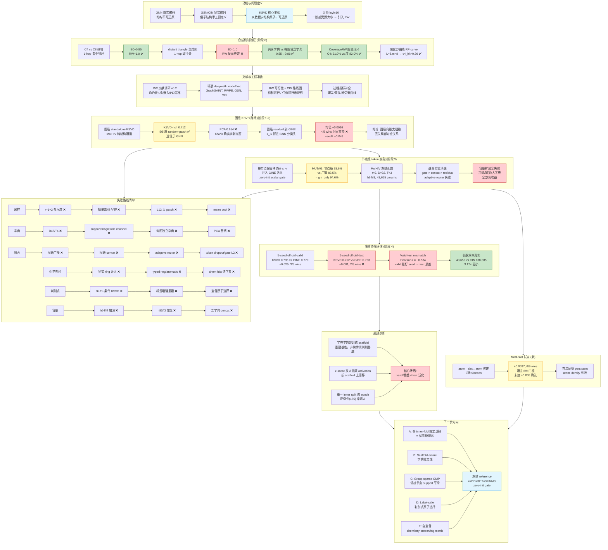

# KSVD 结构字典学习路线：完整实验回顾

> **编写日期：** 2026-07-27  
> **目的：** 让一个没有接触过本实验的人，完整把握整条理路——从动机、方法、各阶段实验、结果、失败路线、到当前瓶颈与下一步方向。  
> **范围：** 包含合成机制验证、MolHIV 图级/节点级、RW 采样、所有失败路线、motif-slot 试点。  
> **来源：** 所有数字均来自本轨 `results/` 目录，协议见各阶段。

---

## 目录

0. [路线全景图](#路线全景图)
1. [核心概念：我们到底在做什么](#1-核心概念我们到底在做什么)
2. [术语表](#2-术语表)
3. [方法全景：KSVD 管道怎么跑](#3-方法全景ksvd-管道怎么跑)
4. [阶段 0：合成机制验证——证明"RW 采样 + KSVD"在原理上成立](#4-阶段-0合成机制验证)
5. [阶段 1：图级 standalone KSVD——在 MolHIV 上验证字典是否有用](#5-阶段-1图级-standalone-ksvd)
6. [阶段 2：图级 residual 到 GINE——结构向量能否提升神经网络](#6-阶段-2图级-residual-到-gine)
7. [阶段 3：Localized node tokens——关键突破](#7-阶段-3localized-node-tokens关键突破)
8. [阶段 4：冻结终端评估——最终结果与核心瓶颈](#8-阶段-4冻结终端评估最终结果与核心瓶颈)
9. [失败路线清单](#9-失败路线清单)
10. [Motif-slot pilot：最新实验](#10-motif-slot-pilot最新实验)
11. [RW 路线状态：与导师 luyin10 的对应](#11-rw-路线状态与导师-luyin10-的对应)
12. [当前瓶颈诊断](#12-当前瓶颈诊断)
13. [下一阶段推荐方向](#13-下一阶段推荐方向)
14. [停止条件与晋级门槛](#14-停止条件与晋级门槛)
15. [关键文件索引](#15-关键文件索引)

---

## 路线全景图



> **图例：** 🟢 绿色 = 成立/有效 | 🟡 黄色 = 部分成立/有信号但不稳 | 🔴 红色 = 失败/无效 | 🔵 蓝色 = 核心概念/当前状态

---

## 1. 核心概念：我们到底在做什么

### 1.1 背景：图结构编码的"显式 vs 隐式"之争

在图上做机器学习，核心问题是：**如何把图的拓扑结构编码成模型能用的数字？**

| 方法 | 结构从哪来 | 是否可还原 | 代表性工作 |
|------|-----------|-----------|-----------|
| **GNN（隐式）** | 消息传递在各节点间聚合邻居信息，结构信息被"压缩"进隐状态 | 否 | GIN, GINE, GAT 等 |
| **GSN（显式，手工子结构）** | 预先定义子结构（环、团等），统计每个节点出现在哪些子结构里，作为额外特征注入 GNN | 否（计数不是分解） | GSN (Bouritsas et al.) |
| **CIN（显式，cell complex）** | 枚举图中所有环，将环提升为"2-cell"，在原子-键-环三层上做消息传递 | 否（隐状态，非分解） | CIN (Bodnar et al.) |
| **KSVD（显式，数据驱动）** | 从图的局部 patch 中**无监督学习**一套"结构原子"（字典），然后用这些原子的稀疏组合表示每个节点周围的结构 | **是**（Y ≈ DX，重构残差可解释） | 本课题 |

**一句话定位：** GSN/CIN 的"子结构"是人工预先定义的（环、团）；KSVD 的"子结构"是从数据里学出来的字典原子。这就是"数据驱动 vs 手工"的核心区别，也是本课题的创新点。

### 1.2 研究问题

> 能否通过**无监督 KSVD 学习出来的局部结构字典**，给普通分子 GNN 提供参数高效、可解释、可泛化的高阶结构信号？

### 1.3 方法边界（我们必须遵守的）

1. KSVD 字典是方法核心，不能退化为可选的附属特征工程
2. 字典**只从训练图 patch 学习**，不用标签
3. 不把人工枚举的环（如 5 元环、6 元环）作为主路线的显式特征（否则和 CIN 没区别）
4. 与 GINE 对照时，保证初始化、数据顺序、epoch 选择等配对条件一致
5. 对 official-valid 和 official-test 的使用严格记录，不能反复用 test 调参

### 1.4 为什么需要 RW（随机游走）？

最初的 KSVD 基线只用每个节点的**一阶邻域**（1-hop，即节点本身 + 直接邻居）作为 patch。但导师在 luyin10 录音中指出：

1. **感受野太小**：1-hop 只看直接邻居，看不到环、更远的结构模式
2. **边冗余**：每个节点都取自己的 1-hop 邻域，同一条边被两个端点各计入一次，有偏置和冗余
3. **子结构选择太粗暴**：不是数据驱动的采样，只是硬切星形

所以导师提出：用**随机游走（Random Walk）**在可控范围内扩大感受野，然后再做 KSVD。但要注意：
- 边尽量少重复覆盖（软惩罚，不硬删边）
- 不必每个节点都游走一遍
- 注意反例：硬删边可能拆坏关键 motif（如氢原子连甲基）

---

## 2. 术语表

### 2.1 核心数学对象

| 符号 | 中文 | 含义 |
|------|------|------|
| **patch** | 局部子图 / 补丁 | 以某个节点为中心，按一定规则选取的局部子图。例如 1-hop 星形，或 RW 访问节点集的诱导子图 |
| **Y** | 结构信号矩阵 | 把所有 patch 向量化后堆叠成的矩阵，每列是一个 patch 的编码 |
| **D** | 字典 | KSVD 学出来的"结构原子"集合，每列是一个原子。例如 D=32 表示有 32 个基础结构模式 |
| **X** | 稀疏系数矩阵 | 每个 patch 用 D 的稀疏线性组合来表示的系数。每列对应一个 patch，非零元素个数 ≤ T |
| **T / sparsity** | 稀疏度 | 每个 patch 最多用几个字典原子来表示。例如 T=3 表示每个节点的局部结构最多由 3 个基本模式组合而成 |
| **OMP（Orthogonal Matching Pursuit）** | 正交匹配追踪 | 一种贪心算法，给定字典 D 和信号 y，找出最多 T 个原子的稀疏组合来逼近 y |
| **KSVD（K-SVD）** | K-均值奇异值分解 | 字典学习算法，交替进行：1) 固定 D，用 OMP 求稀疏 X；2) 固定 X，逐原子更新 D（用 SVD）。目标是 Y ≈ DX |

### 2.2 采样相关

| 术语 | 含义 |
|------|------|
| **B0（1-hop 基线）** | 每个节点取自己 + 直接邻居作为 patch。这是最原始的基线，感受野最小 |
| **B1（均匀 RW）** | 从节点出发做均匀随机游走（p=q=1），把访问过的节点集做成 patch |
| **M0（偏置 RW）** | 带 p, q 参数的 node2vec 风格游走，可以控制游走偏向 BFS（广度优先）还是 DFS（深度优先） |
| **CoverageRW** | 图级覆盖驱动游走：不是每个节点都游走，而是选少量种子、控制边覆盖率的策略 |
| **p, q** | node2vec 参数。p 控制"回头"概率（p 大 = 少回头），q 控制"外扩 vs 局部"（q>1 = 偏 BFS/局部，q<1 = 偏 DFS/外扩） |
| **L / walk_length** | 游走步数（最多走多少步） |
| **m / max_nodes** | patch 节点数上限（去重后最多取多少节点） |
| **诱导子图（induced subgraph）** | 给定节点集 S，从原图提取 S 中所有节点以及它们之间在原图中的所有边。不同于"只保留路径上的边" |
| **edge_decay / 软降权** | 边被走过一次后，权重乘以 γ（如 0.7），下次再走这条边的概率降低。目的是减少重复覆盖，但不删除边 |
| **hard_delete** | 硬删边——从邻接表永久删除边。本课题**始终禁止**（会破坏结构 motif） |

### 2.3 读出与融合

| 术语 | 含义 |
|------|------|
| **readout / 读出** | 把稀疏系数矩阵 X 压成一个固定长度的图级别向量（例如对每个原子的系数取均值、最大值、分位数等统计量） |
| **rich readout** | 丰富的读出统计量：每个原子的 mean\|x\|、max\|x\|、std、nonzero 比例、分位数、能量等，共 88 维 + 图大小 2 维 = 90 维 |
| **moments readout** | 精简版读出：每个原子只取 mean\|x\|、std\|x\|、mean(x²)，共 24 维 + 2 维 = 26 维 |
| **s_v（节点系数）** | 每个节点 v 的稀疏系数向量，维数 = 字典原子数（如 D=32 则 32 维）。描述了 v 周围的局部结构由哪些原子组成 |
| **s_G（图向量）** | 整张图的读出向量，由所有节点的 s_v 汇总而来 |
| **concat 融合** | 把 s_v 直接拼接到节点原始属性特征后面，一起输入 GNN |
| **residual 融合** | 在 GNN 每层输出后加上一个可学习的线性变换：h = h + W·s_v |
| **gate 融合** | 在 residual 基础上加一个可学习的标量门控：h = h + σ(g)·W·s_v，其中 g 是可学习的标量参数。zero-init 表示初始时 g=0，模型严格等于纯 GINE |
| **zero-init gate** | 门控初始值为 0，保证训练开始时模型完全等于纯 GNN（不会一开始就被未校准的结构通道带偏） |

### 2.4 数据集与评估

| 术语 | 含义 |
|------|------|
| **MolHIV / ogbg-molhiv** | OGB（Open Graph Benchmark）提供的分子性质预测数据集。41,127 个分子图，预测是否抑制 HIV。标签极度不平衡（正例约 3.5%） |
| **scaffold split** | 按分子骨架（Bemis-Murcko scaffold）划分训练/验证/测试集，而不是随机划分。**这是关键难点**：训练集和测试集的分子骨架不同，测试能否泛化到新骨架 |
| **official train/valid/test** | OGB 官方提供的 scaffold split，分别为 32,901 / 4,113 / 4,113 个图 |
| **inner split** | 在 official train 内部再划分一个 inner-train（85%）和 inner-valid（15%），用来选 epoch 而不碰 official-valid。这是防止数据泄漏的协议设计 |
| **ROC-AUC** | 评估指标。对极度不平衡的二分类（MolHIV 正例 ~3.5%），AUC 比 Accuracy 更合理 |
| **ensemble** | 多个 seed 的模型预测概率取算术平均。可以降低单 seed 方差 |
| **Xu protocol** | Xu et al. (ICLR 2019) 的 GIN 论文评估协议：10-fold，选全局 epoch（所有 fold 平均 Acc 最大的那个 epoch），报告该 epoch 的 fold 均值和标准差。偏乐观，与 strict 10-fold 不同 |
| **paired t-test** | 配对 t 检验，看两个方法在相同 seed 下的差异是否统计显著。这里 n=5 太小，通常不显著 |

### 2.5 关键方法缩写

| 缩写 | 全称 | 含义 |
|------|------|------|
| **GIN** | Graph Isomorphism Network | 一种经典 GNN 架构，Xu et al. 2019 |
| **GINE** | GIN with Edge features | GIN 的扩展，支持边特征（如化学键类型） |
| **CIN** | Cellular Isomorphism Network | Bodnar et al. 2021，在 cell complex 上做消息传递，显式枚举环 |
| **GSN** | Graph Substructure Network | Bouritsas et al.，用预定义子结构计数作为额外特征 |
| **WL** | Weisfeiler-Lehman | 图同构检验算法。1-WL 是 GNN 表达力的理论上界 |
| **PCA** | 主成分分析 | 线性降维方法，作为 KSVD 的对照（看看"学字典"是否比"普通矩阵分解"更好） |

---

## 3. 方法全景：KSVD 管道怎么跑

### 3.1 训练阶段（只用 official train 图）

```
训练集中的所有图
  → 对每个原子节点取 radius-2 ego patch（局部邻域）
  → 把每个 patch 向量化（固定维度的 permutation-invariant 表示）
  → 随机采样最多 6000 个 patch 向量，堆成矩阵 Y（848 维 × 6000 列）
  → KSVD 算法：
      1. 初始化字典 D（随机从 Y 中选列，加微扰）
      2. 固定 D，用 OMP 求稀疏系数 X（每个 patch 用最多 T=3 个原子表示）
      3. 固定 X，逐原子用 SVD 更新 D 的每一列
      4. 重复 2-3 共 3 轮
  → 输出：字典 D（848×32）和所有训练节点的稀疏系数 X
  → 对 X 做 z-score 归一化（只用训练集统计量）
```

### 3.2 编码阶段（训练/验证/测试图）

```
对图中每个原子节点
  → 取 radius-2 ego patch → 向量化得 y
  → OMP(D, y) → 稀疏系数 x（32 维，最多 3 个非零）
  → 应用训练集上拟合的 z-score 归一化
  → 得到该节点的结构 token s_v
```

### 3.3 下游分类阶段

```
GINE backbone（hidden=64, layers=3）
  → 每层消息传递 + 层间注入 KSVD token：
      h^(l+1) = GINEConv(h^(l)) + gate^(l) * W^(l) * s_v
  → gate^(l) 初始为 0（模型开始时等于纯 GINE）
  → 3 层后做全局 mean pooling → 分类头 → 输出
```

### 3.4 两个模式：图级 vs 节点级

| 模式 | patch 尺度 | 字典使用 | 下游融合 | 适用场景 |
|------|-----------|---------|---------|---------|
| **图级（graph-level）** | 从整图采集少量 patch（种子策略，非全点） | 所有 patch 编码后 readout 成图向量 s_G | s_G 输入 LR 分类器，或作为 GINE 的 residual | 早期 feasibility 验证、纯结构分类 |
| **节点级（node-level）** | 每个节点都取自己的 ego patch | 每个节点保留自己的稀疏系数 s_v | s_v 注入 GINE 各层（gate/residual） | MolHIV 主实验、与 GNN 深度融合 |

**关键教训：** 图级模式从早期到后期多次被证明"上限不足"（s_G 太粗糙，丢失了"哪个节点激活了哪个原子"的局部对应关系）。节点级 token 是当前有效路线。

---

## 4. 阶段 0：合成机制验证

### 4.1 目的

在可控的合成图上，证明两个命题：
1. **RW 采样能采到 1-hop 采不到的结构**（如环）
2. **共享字典 KSVD 能从 patch 中提取有用的结构信号**

不依赖真实分子数据，不宣称下游 SOTA。

### 4.2 实验 1：C4 vs C8 任务

**任务设计：** 两类图，节点数和边数相同，唯一的区别是——
- 类 0：包含 C4（四元环）+ 树挂叶
- 类 1：包含 C8（八元环）+ 树挂叶

**关键洞察：** 环上某个节点的 1-hop 邻域只有 3 个节点（自己 + 两个邻居），诱导子图是 P3（一条长度为 3 的路径），**看不到闭合的环**。必须感受野 ≥ 4 个节点才能看到环。

**结果：**

| 方法 | 5-fold Acc | 说明 |
|------|-----------|------|
| 度特征 | 0.829 | 树挂法带来度分布差异，有一些泄漏 |
| c4_count（标签检查） | 1.000 | 确认标签干净 |
| B0（1-hop）+ KSVD | ~0.85 | 1-hop 上限，看不到环 |
| **B1（均匀 RW）+ 共享 KSVD** | **~1.0** | 游走感受野够到环 |
| **M0（偏置 RW）+ 共享 KSVD** | **~1.0** | 同上 |

**结论：** 在"需要多跳感受野才可分"的任务上，RW+KSVD 相对 1-hop 有本质优势（+0.15 量级）。这是**机制成立**的核心证据。

### 4.3 实验 2：Distant triangle 任务（负对照）

**任务设计：** 两端各有一个三角形的图 vs 同端有两个三角形的图。

**结果：** B0（1-hop）≈ 1.0，RW 反而更差（~0.8-0.95）。

**结论：** 1-hop 星形已经能看到三角（三个邻居节点互相连接），不需要更大感受野。RW 反而把局部判别信号"涂抹"掉了。这证明**RW 不是万能药**——任务需要多跳信息时 RW 才有价值。

### 4.4 实验 3：共享字典 vs 每图独立字典

**问题：** 最初实现中，每张图自己学一套字典 D_g。这意味着图 A 的"原子 1"和图 B 的"原子 1"没有对应关系，跨图系数不可比。

**实验：** 合成三角分类任务上——
- 每图独立字典：~0.55
- **共享字典（training set 统一学）**：**~0.86**

**结论：** 共享字典是 KSVD 可用的**必要条件**。之后所有实验都默认共享字典。

### 4.5 实验 4：图级 CoverageRW 闭环

**算法：** CoverageRW-KSVD-Readout（见 `notes/graph_level_algorithm.md`）
- 种子：度分层抽样，预算 max_walks=12
- 游走：node2vec (p=0.5, q=2.0), L=8, m=8
- 软降权：边权 ×0.7
- 早停：轨迹边覆盖率 ≥ 0.95 或用尽预算
- KSVD：D=12, T=3，共享字典
- 读出：energy/rich readout → LR 分类

**过程指标：**

| 指标 | C4 集 (200 图) | B0 对照 |
|------|---------------|---------|
| 平均 walk 数 | 5.7 | 14.0 |
| 轨迹边覆盖率 | 1.0 | 1.0 |
| 平均 patch 大小 | 6.65 | 3.00 |

**闭环分类：**

| 模式 | C4 vs C8 Acc |
|------|-------------|
| 度基线 | 82.0% |
| B0+KSVD | 82.0% |
| **CoverageRW+KSVD** | **91.0%** |

**结论：** 密度基线 82.0%，CoverageRW 在同样不依赖属性特征的前提下达到 91.0%。这是**图级 RW 采样在闭环上生效**的证据。

### 4.6 实验 5：感受野曲线（RF curve）

**问题：** 游走多长（L）多大（m）才够？

**结果（C4 命中率）：**

| 配置 | c4_hit（至少一个 patch 包含 C4 的图比例） |
|------|------------------------------------------|
| B0 (1-hop) | 0.000 |
| RW L=4, m=4 | 0.325 |
| RW L=6, m=6 | 0.887 |
| RW L=8, m=8 | 0.988 |
| RW L=12, m=10 | 1.000 |

**结论：** L=8, m=8 是性价比较高的默认配置。不做全点游走（B0 需要 14 个 walk），coverage 模式只需 ~5.7 个 walk 就能达到同样的覆盖。

### 4.7 阶段 0 总结

| 命题 | 状态 | 证据 |
|------|------|------|
| 共享字典必要 | ✅ 成立 | 0.55→0.86 |
| 1-hop 感受野有上限 | ✅ 成立 | C4 上 B0~0.85 |
| RW 能扩大感受野 | ✅ 成立 | C4 上 RW~1.0 |
| RW 不是处处更好 | ✅ 成立 | 三角任务上 B0 满分、RW 更差 |
| MUTAG 下游增益 | ❌ 未成立 | 结构通道仍弱于度/属性 |

---

## 5. 阶段 1：图级 standalone KSVD

### 5.1 目的

在 MolHIV 真实分子数据上，回答：**KSVD 字典学习是否比随机/PCA 更有用？**（不涉及神经网络，纯结构通道 + 逻辑回归）

### 5.2 实验设置

- 数据：ogbg-molhiv，official scaffold split
- Patch：CoverageRW，max_nodes=8，每图最多 8 个 patch
- 向量化：524 维 wl_chem_ring（WL 标签 + 化学信息 + 环统计）
- 字典：D=8, T=2, KSVD 4 轮迭代，最多 4000 个训练 patch
- 分类器：StandardScaler + LogisticRegression (balanced)
- 对照：同 patch pool 的 random-patch（随机选 patch 向量当字典，不做 KSVD 更新）和 PCA

### 5.3 结果（5 dictionary seeds，完整 official train/valid）

| 方法 | valid AUC mean ± SD | vs random-patch | paired wins |
|------|---------------------|-----------------|-------------|
| size only（节点数+边数） | 0.6787 | — | — |
| random-patch + rich | 0.6846 ± 0.0162 | — | — |
| **KSVD + rich** | **0.7121 ± 0.0099** | **+0.0275** | **5/5** |
| random-patch + moments | 0.6904 ± 0.0124 | — | — |
| KSVD + moments | 0.7022 ± 0.0010 | +0.0118 | 4/5 |
| PCA + rich | 0.6543 | — | — |

**每 seed 明细（rich）：**

| seed | random-patch rich | KSVD rich | KSVD − random |
|------|-------------------|-----------|---------------|
| 0 | 0.7093 | 0.7164 | +0.0071 |
| 1 | 0.6657 | 0.7274 | +0.0617 |
| 2 | 0.6876 | 0.7029 | +0.0153 |
| 3 | 0.6844 | 0.7063 | +0.0219 |
| 4 | 0.6762 | 0.7077 | +0.0315 |

### 5.4 结论

1. KSVD 字典学习**确实比随机 patch 和 PCA 学到了更有用的结构基底**（5/5 胜出，均值 +0.028）
2. 但 0.712 仍远低于常见分子 GNN（~0.80），**单靠结构通道不够当主分类器**
3. Rich readout（88 维统计量）比 moments（24 维）更强，但 KSVD seed SD 也更大
4. 非线性分类器（RBF SVM、HistGradientBoosting）在小子集上过拟合或高方差，**最终固定为 logistic**

---

## 6. 阶段 2：图级 residual 到 GINE

### 6.1 目的

把图级 KSVD 结构向量作为 GINE 的额外输入，看能否提升 GNN 性能。

### 6.2 实验设置

- 固定 8000 图子集（分层抽样）
- Inner-checkpoint 协议：official train 内 85/15 split 选 epoch，然后在全 train 上重训，official valid 只评估一次
- 结构特征：KSVD seed0 的 8 维 max-activation
- Residual head：零初始化，LR 为 base LR 的 0.1

### 6.3 结果

| neural seed | GINE valid AUC | residual valid AUC | paired Δ |
|-------------|---------------|-------------------|-----------|
| 0 | 0.7386 | 0.7585 | +0.0199 |
| 1 | 0.7333 | 0.7482 | +0.0148 |
| 2 | 0.7525 | 0.7097 | **−0.0427** |
| 3 | 0.7879 | 0.8031 | +0.0152 |
| 4 | 0.7801 | 0.7810 | +0.0010 |
| **mean** | **0.7585** | **0.7601** | **+0.0016** |

### 6.4 结论

- 方向一致性 4/5（多数 seed 有益），但均被一个大的负 outlier（−0.0427）抵消
- 图级向量放在 GNN 头上进来太晚，无法参与中间层的消息传递——这是结构使用方式的问题，不是结构信号本身的问题
- 这成为后续转向"节点级 token"的直接动机

---

## 7. 阶段 3：Localized node tokens——关键突破

### 7.1 核心思路转变

从：
```
graph → many patches → one graph vector → classifier
```
变为：
```
each atom → local radius-2 ego patch → KSVD sparse code (32 dim)
           ↓
GINE layer-wise message passing with localized structural tokens
```

**关键变化：** 不再把稀疏系数压成图级的一个向量，而是保留在节点层面，每个原子有自己的结构 token，随 GINE 消息传递共同演化。

### 7.2 实验设置（冻结配置）

- **Patch：** radius-2 ego patch（每个原子取两跳以内的局部邻域），permutation-invariant 向量化，848 维
- **字典：** D=32, T=3, KSVD 3 轮迭代，最大训练 patch 数 6000
- **Token 归一化：** train-only z-score（只用训练集统计量，不泄漏）
- **Token 通道：** signed coefficients（保留正负号，不额外拼接 absolute magnitude 或 support mask）
- **Backbone：** GINE, hidden=64, layers=3, dropout=0, lr=1e-3, batch_size=128
- **融合方式：** 每层 zero-init scalar gate——初始时模型严格等于纯 GINE，训练中网络自行决定每层是否以及以何符号使用 KSVD 通路
- **参数量：** 43,655 trainable（含 token projection + 3 个 layer gates），+ 27,136 固定字典值 = 70,791 total stored values

**对照：CIN 参数量**
- CIN-small h48：138,385 trainable（本文的 3.17×）
- CIN h64：239,809 trainable（本文的 5.49×）
- CIN++ h64：365,377 trainable（本文的 8.37×）

### 7.3 为什么选择 zero-init scalar gate 而不是更复杂的融合？

实验比较过多种融合方式，发现：
- **per-node adaptive router**（每个节点自己的门控）：0/3 胜出，−0.015，给了模型过多自由度去学 scaffold-specific 用法
- **简单 global scalar gate**：反而更好，因为参数少，强制模型学到"所有节点共享的"结构使用策略，不容易过拟合

### 7.4 配置选择的关键决策

| 选择 | 理由 |
|------|------|
| radius=2 而非 radius=1+2 | radius-2 已包含 radius-1 的多数信息，多尺度拼接造成冗余 |
| D=32 而非 D=48 | D=48 反而 −0.071，更大字典增加高度相关或低支持 atom，放大噪声 |
| h64/l3 而非 h64/l4 或 h80/l3 | 加深/加宽都是负收益，更大 backbone 更容易吸收训练 scaffold 的偶然相关性 |
| signed only 而非 signed+abs+support | 额外 channel 没有改善，可能使网络更容易依赖 activation frequency 而非稳定语义 |
| zero-init gate 而非 token dropout/gate L2/限层注入 | 其他正则化方式没有形成稳定超过全层、zero-init global gate 的配置 |

---

## 8. 阶段 4：冻结终端评估——最终结果与核心瓶颈

### 8.1 协议

每个 seed 的流程：
1. 在 inner-train（27,965 图）上训练最多 30 epochs
2. 只根据 inner-valid（4,936 图）ROC-AUC 选 epoch
3. 用相同 seed 在完整 official train（32,901 图）上从头重训到 selected epoch
4. official-valid 评估一次（4,113 图）
5. 冻结后 terminal suite 中 official-test 评估一次（4,113 图）

**重要披露：** 早期 feasibility 阶段曾查看过 official test。因此本轮只能称为"冻结后受控 terminal evaluation"，不能声称是完全 untouched test。冻结之后没有根据 test 结果选择或修改模型。

### 8.2 Official-valid 结果

**5 个 seed 单模型：**

| seed | GINE h64 valid | KSVD h64 valid | paired Δ |
|------|---------------|----------------|-----------|
| 0 | 0.7318 | 0.8056 | **+0.0738** |
| 1 | 0.8138 | 0.7678 | −0.0460 |
| 2 | 0.7784 | 0.8556 | **+0.0771** |
| 3 | 0.7448 | 0.7685 | +0.0236 |
| 4 | 0.7809 | 0.7753 | −0.0056 |
| **mean** | **0.7700** | **0.7946** | **+0.0246** |

- KSVD wins：3/5
- Paired t-test p = 0.3545（n=5 太小，不显著）
- 但两个大幅正增益（+0.074, +0.077）说明 KSVD 通路包含真实可利用信号

**5-seed ensemble（预测概率取平均）：**

| family | official-valid ensemble AUC |
|--------|---------------------------|
| GINE h64 | 0.7986 |
| GINE h70（参数量匹配） | 0.8106 |
| **KSVD h64 D32/T3** | **0.8286** |

Ensemble 上 KSVD 相对 GINE-h64 +0.030，相对 GINE-h70 +0.018。说明不同 seed 的 KSVD 模型捕获了互补排序信号。

### 8.3 Official-test 结果——这才是关键

**5 个 seed 单模型：**

| seed | GINE h64 test | GINE h70 test | KSVD test |
|------|--------------|--------------|-----------|
| 0 | 0.7634 | 0.7648 | 0.7556 |
| 1 | 0.7277 | 0.7744 | 0.7418 |
| 2 | 0.7553 | 0.7767 | 0.7365 |
| 3 | 0.7634 | 0.7549 | 0.7755 |
| 4 | 0.7537 | 0.7456 | 0.7500 |
| **mean** | **0.7527** | **0.7633** | **0.7519** |

**与 GINE-h64 配对比较：**
```
KSVD − GINE-h64 = [−0.0077, +0.0141, −0.0189, +0.0122, −0.0037]
mean = −0.0008, wins = 2/5, p = 0.9036
```

**与 GINE-h70（参数量匹配）配对比较：**
```
KSVD − GINE-h70 = [−0.0091, −0.0326, −0.0403, +0.0207, +0.0044]
mean = −0.0114, wins = 2/5, p = 0.3719
```

**Test ensemble：**

| family | official-test ensemble AUC |
|--------|---------------------------|
| **GINE h70** | **0.7776** |
| GINE h64 | 0.7752 |
| KSVD h64 D32/T3 | 0.7704 |

### 8.4 核心发现：Valid-test mismatch

**这是本路线目前最关键的发现：**

| seed | KSVD valid | KSVD test | 方向 |
|------|-----------|-----------|------|
| 2 | 0.8556（最高） | 0.7365（最低） | valid 最好 → test 最差 |
| 3 | 0.7685（较低） | 0.7755（最高） | valid 较低 → test 最好 |

**Valid-test Pearson correlation：−0.534**（对 KSVD）、−0.914（对 GINE-h64）。

这意味着：**当前 valid ranking 完全不能用于选择部署 seed。** 在 valid 上看好的模型，在 test 上可能最差。

### 8.5 结论

**可以做的主张：**
1. KSVD 学习到的字典原子比 matched random patches / PCA 更有用
2. Localized node-token 比 graph-level KSVD readout 更有潜力
3. 在 valid 上 KSVD 相对 GINE-h64 平均 +0.025，3/5 wins
4. 参数效率：43,655 trainable，显著少于 CIN（3.17× 到 5.49×）
5. 增大 width、depth、dictionary 和 router 均未提升，说明 compactness 不是偶然遗漏
6. 5-seed ensemble 能显著提升稳定性

**不能做的主张：**
1. 不能说已经稳定到 test 0.80
2. 不能说已经达到或超过 CIN（CIN 约 0.8094±0.0057，当前 KSVD test 0.7519）
3. 不能说在 test 上稳定强于 GINE
4. 不能把 seed 2 的 valid 0.8556 当作可复现总体性能
5. 不能称本轮 test 为 untouched test
6. 不能只报 43,655 而不披露固定字典

---

## 9. 失败路线清单

以下是所有尝试过但**没有通过 screen** 的路线。不是"没做"，而是"做了但不行"。

### 9.1 采样与 patch 设计

| 路线 | 现象 | 判断 |
|------|------|------|
| **Radius 1+2 多尺度拼接** | 没有优于单 radius-2 | r=2 已包含 r=1 信息，多尺度拼接造成冗余和优化噪声 |
| **抬升覆盖率/关早停** | valid 崩 | 不是覆盖不够，而是更多 patch 引入噪声 |
| **盲目 L=12 大 patch** | residual 下负贡献（−0.061） | 太大感受野混入噪声/规模相关模式 |
| **mean pool（图级）** | 0.491 vs max 0.637 | 最大激活比平均值更稳定 |

### 9.2 字典与编码

| 路线 | 现象 | 判断 |
|------|------|------|
| **D=48, T=4** | inner mean −0.071，0/3 wins | 更大字典 = 更多高度相关/低支持原子，OMP support 选择更不稳定 |
| **Support / magnitude 额外 channel** | 无改善 | signed coefficient 已包含主要信息 |
| **每图独立字典** | 合成 0.55 vs 共享 0.86 | 系数不可跨图比较，字典是 KSVD 的核心，但共享是必要条件 |
| **PCA 替代 KSVD** | 0.654 vs KSVD 0.712 | 普通低秩投影不是字典学习 |

### 9.3 融合方式

| 路线 | 现象 | 判断 |
|------|------|------|
| **图级广播（s_G 复制到所有节点）** | MUTAG 83.5% vs 节点级 93.6% | 严重掉分，全图结构向量相同，丢失局部差异 |
| **图级 concat 进 GINE** | 烟测 test 0.70 vs gine_only 0.78 | 结构信号太晚、太粗糙 |
| **per-node adaptive router** | −0.015，0/3 wins | 给了太多自由度学 scaffold-specific 用法 |
| **Token dropout / gate L2 / 限层注入** | 无稳定超过全层 zero-init gate | 简单 global scalar gate 反而是有效 regularizer |

### 9.4 显式化学结构

| 路线 | 现象 | 判断 |
|------|------|------|
| **Ring-member injection / readout** | best +0.0008，1/3 wins | 不达预声明门槛（+0.003，≥2/3 wins） |
| **Typed ring / aromatic 显式特征** | 未稳定超过 type-count/PCA | 往 CIN 的手工拓扑对象靠拢，削弱 KSVD 自学习字典的创新点 |
| **Chem histogram 进字典** | 相对 size 几乎无增益（−0.003） | 粗原子/键直方图可能与属性通道冗余 |

### 9.5 条件与判别式字典

| 路线 | 现象 | 判断 |
|------|------|------|
| **D+/D- 条件 KSVD** | activation/reconstruction margins 均不稳定 | 正负样本字典分离不可靠 |
| **标签增强重建目标** | 5 seeds paired mean +0.0007 | 无实质增益 |
| **16→8 监督原子选择** | seed0 KSVD 不胜 matched random-patch | 监督选择破坏 KSVD 无监督优势 |
| **50% positive patch reweighting** | 3/5 paired 胜出，不达 5/5 | 不稳定 |

### 9.6 容量扩展

| 路线 | 现象 | 判断 |
|------|------|------|
| **KSVD h64/l4（加深）** | inner mean −0.0015，方差 0.0177 → 大幅增加 | 更多层 = 更多机会过拟合训练 scaffold |
| **KSVD h80/l3（加宽）** | inner mean −0.0187 | 更宽 backbone 更容易吸收偶然相关性 |
| **五字典直接 concat residual** | seed0 valid 0.791 < GINE 0.804 | 多字典拼接不自动更好 |

### 9.7 Motif-slot readout

按字典原子 slot 做图级 motif aggregation/readout 没有通过 screen。它可能重新退化为图级 histogram，丢掉 localized message passing 的优势。

---

## 10. Motif-slot pilot：最新实验

### 10.1 思路

在 GINE 层间插入 atom→dictionary-slot→atom 传递——让同一字典原子在整图内不同出现位置之间交换信息。

### 10.2 设置

- 3 折 Bemis-Murcko scaffold split（scaffold 不跨 inner train/valid），**不碰 official-valid/test**
- 每折自己拟合字典（只从 inner-train）
- GINE-JK backbone + 层间 motif-slot transport
- KSVD: r=2, D=32, T=3, motif bottleneck rank 16, zero-init residual gate, gate scale 0.25

### 10.3 结果

**3 折 × 3 seeds：**

| 指标 | 值 |
|------|-----|
| GINE mean | 0.7174 |
| KSVD motif-slot mean | 0.7211 |
| Paired mean Δ | +0.0037 |
| Wins | 6/9 |
| Δ SD | 0.0056 |

**对照：** KSVD motif-slot 在全部 3 折上都优于 shuffled-ID 和 no-ID 对照（均值 +0.0085 和 +0.0080），也优于 PCA（2/3 折，均值 +0.0025）。

### 10.4 判断

- 通过预声明 6/9 门槛，但**未达 +0.005 确认门槛**
- 这是第一次证明 persistent dictionary-atom identity 贡献了超越普通额外消息传递的东西
- P1 下一步：把每个 (graph, dictionary atom) 拆成空间上相连的 motif 出现位置，做 atom↔occurrence transport
- **尚未碰 official-valid/test**

---

## 11. RW 路线状态：与导师 luyin10 的对应

### 11.1 录音要求拆解

| ID | 导师意图 | 状态 |
|----|---------|------|
| R1 | 一阶感受野有上限，要扩大感受野 | ✅ 论述 + C4 合成实验 + RF 曲线 |
| R2 | 用 RW 构建分解前的子图/感受野 | ✅ 管道 + C4 闭环 |
| R3 | 先调查文献与约束 | ✅ v0.2 角色表 + 精读链 |
| R4 | 边尽量少重复覆盖 | ✅ 过程主表 + 软降权 |
| R5 | 不必每个点都游走，软惩罚 | ✅ coverage 采样（分层/uncovered 种子 + 预算） |
| R6 | 忌硬删边 | ✅ hard_delete=False 不变量 |
| R7 | KSVD 后融合 | ⚠️ 试过，MUTAG 几乎无增益 |
| R8 | 不要求立刻 molhiv 超 CIN | ✅ 遵守 |

### 11.2 三层证据状态

| 层 | 问题 | 状态 | 证据 |
|----|------|------|------|
| **A 机制** | 更大感受野能否采到 1-hop 没有的闭包？ | ✅ **强** | C4~1.0 vs B0~0.85；RF 曲线；可视化 |
| **B 表征** | D,X 是否对齐、可诊断？ | ✅ **中** | 共享 D 0.55→0.86；recon 不可跨 B0/RW 比 |
| **C 下游** | 同协议是否稳定涨点？ | ❌ **弱** | MUTAG 最好约 +1pt 且不稳；MolHIV test 打平 |

### 11.3 定位

**RW 方案还浅吗？** 是——实现是可行性探针，不是覆盖约束下的完整采样理论。

**可行性？** 机制可行已部分证明；任务可行未证明。

**到 CIN 级？** 要走 A→B→C→D（环/结构对象 + 进计算图 + 分子协议），不能只加深 walk。

---

## 12. 当前瓶颈诊断

### 12.1 不是容量不够，是泛化不够

**最大瓶颈：valid 上的 +2.5pt 增益，在 test 上完全消失（甚至转负）。**

原因分析：

#### A. KSVD 学的是训练 scaffold 的重建基底，不是跨 scaffold 的判别基底

- 标准 KSVD 优化目标是 patch reconstruction（重构误差最小化）
- 它可能把训练 scaffold 中频繁出现、容易重构的模式学得很好
- 但这些模式不一定是跨 scaffold 保持标签相关性的化学结构
- 欧氏重建误差对应的几何相似性，与跨骨架的化学语义相似性不一致

#### B. z-score 会把低频 activation 放大

- 稀疏 code 中低频 atom 的尺度可能在新 scaffold 上不稳定
- valid 上偶然有利的 rare activation，test 上可能转为噪声
- train-only z-score 本身没有泄漏，但归一化后的值在 unseen scaffold 上可能漂移

#### C. 单一 inner split 对 epoch 的选择噪声较大

- MolHIV 正样本少，inner-valid 只有 185 个正例
- ROC-AUC 的 epoch 曲线容易受少数排序变化影响
- 当前每个 seed 只用一个固定 inner split（seed=1729），selected epoch 的估计方差仍可能很大

#### D. 当前 token 是局部结构摘要，尚未学到 chemistry-preserving motif equivalence

- radius-2 patch 同时混合拓扑、原子与键属性
- KSVD 的欧氏重构几何未必与分子 scaffold 变化下的任务相似性一致

### 12.2 为什么继续堆容量已经无效

已完成 inner-only screen 的结果：

| 配置 | Δ vs KSVD h64/l3 | 走向 |
|------|-------------------|------|
| KSVD h64/l4（加深） | −0.0015，方差暴增 | 更差 |
| KSVD h80/l3（加宽） | −0.0187 | 更差 |
| D48/T4（加大字典） | −0.0707 | 明确失败 |
| adaptive router | −0.0150 | 0/3 失败 |

**结论：** 当前小模型不是明显 underfit 状态。更大 backbone 更容易吸收训练 scaffold 的偶然相关性，进一步放大 valid-test mismatch。

---

## 13. 下一阶段推荐方向

按"保持 KSVD 核心"与"最有可能解决 test 泛化"排序：

### 路线 A：多 inner-fold 的 epoch / checkpoint 稳定选择（优先级最高）

**目的：** 先解决 selection noise，而不是改模型。

**做法：**
1. official train 内固定 3 个 stratified inner folds
2. 每个 epoch 计算跨 fold mean AUC 或 rank-stability
3. 选择平均最好、且 fold variance 受控的 epoch
4. 最终仍只在 official train 重训一次
5. 不查看 official test

**风险：** 计算约为当前 inner selection 的 3 倍。  
**收益：** 很可能比继续加参数更直接地缓解 valid-test seed mismatch。

**注意：** 由于 official-test 已经看过，后续开发需要建立新的内部 scaffold split 或外部数据集作为 development benchmark。

### 路线 B：Scaffold-aware dictionary stability（最符合研究初衷）

**目的：** 保持 KSVD 无监督目标，但要求原子在不同 train scaffolds 上稳定。

**做法：**
1. 将 official-train 按 scaffold 分组
2. 学多个 bootstrap/scaffold dictionaries
3. 计算 atom matching / activation stability
4. 只保留跨 scaffold 稳定原子，或对不稳定原子加 shrinkage
5. 固定 D=32 上限，不增加字典大小

**意义：** 不是告诉模型"环是什么"，而是让数据自己学出跨 scaffold 可重复的字典原子。

### 路线 C：Group-sparse / structured OMP

**目的：** 让同一 molecule 内邻近节点的 support 更平滑，减少单节点 noisy support flip。

**做法：**
- group OMP（同一分子的邻近节点共享 support 正则化）
- graph-fused sparse coding
- 邻接节点 support consistency regularizer
- molecule-level atom usage budget

**注意：** 应先在 inner scaffold splits 上验证；实现复杂度高于路线 A/B。

### 路线 D：Discriminative but label-safe dictionary selection

**目的：** 从纯 reconstruction 转向 task-relevant atom selection，但协议必须 nested 防止 feature-selection leakage。

**做法：**
1. 先无监督学习较大的 candidate dictionary
2. 只在 official-train inner splits 内做 atom stability / mutual-information selection
3. 外层严格重新拟合
4. 保持最终字典 ≤ 32 atoms

### 路线 E：自监督 chemistry-preserving patch metric（上限最高，工作量最大）

**目的：** 先学习一个不使用 HIV label 的 patch embedding，再在 embedding 空间做 KSVD。

**做法：**
- masked atom/bond reconstruction
- augment-consistency
- scaffold-preserving contrastive pretraining
- 再在 embedding 空间做 KSVD

**意义：** KSVD 仍负责学习字典和稀疏分解；自监督 encoder 只改变 patch metric。解决欧氏重构距离与化学相似性不一致的问题。

### 路线 F：效率主线的完整测量

如果参数效率要成为论文卖点，需要测：
- trainable parameters（已有）
- dictionary stored values（已有）
- optimizer state memory
- peak GPU/CPU memory
- train seconds / epoch
- dictionary fitting time
- test encoding time（已有：4,113 图、103,927 节点约 50.8s）
- 单模型与 5-seed ensemble 总成本

---

## 14. 停止条件与晋级门槛

### 14.1 当前冻结 reference

```
radius=2
D=32 / OMP T=3
hidden=64 / GINE layers=3
zscore signed token
all-layer zero-init scalar gate
```

**为什么保留它：** 不是因为 test 最好，而是因为：
- 它是冻结前最强 KSVD 配置
- 在 valid 上有结构信号
- 参数量最小
- capacity/dictionary/router scaling 均失败
- 机制最简洁，最容易归因

### 14.2 已停止的方向

- 继续加宽/加深/加大字典
- 显式 ring 主路线
- 图级 concat 进 GINE
- 抬升覆盖/关早停
- mean pool / 无监督 MIL attention
- FDDL/LC 全家桶
- 用单 seed 子集 AUC 讲"分子任务胜利"

### 14.3 晋级门槛（新路线必须满足）

1. 3 个或以上 scaffold inner folds
2. 相对 frozen KSVD reference mean Δ ≥ +0.005
3. 至少 2/3 或 3/5 paired wins
4. fold/seed std 不明显增加
5. 参数量增幅不超过 25%，除非收益超过 +0.01
6. 不使用 official-test 做选择

---

## 15. 关键文件索引

> 以下路径均相对于 track 根目录 `tracks/ksvd/`。

### 核心文档

| 文件 | 内容 |
|------|------|
| `notes/definition.md` | KSVD 组内定义（Y/D/X 形式化、管道、理论边界） |
| `notes/plan.md` | 执行计划（阶段 0–3） |
| `notes/rw_survey.md` | RW 文献调研 v0.2（角色表、证据分层） |
| `notes/rw_feasibility_and_cin_path.md` | 录音达标对照 + 通向 CIN 量级思路 |
| `notes/graph_level_algorithm.md` | CoverageRW-KSVD-Readout 默认算法 |
| `notes/shared_dict.md` | 共享字典决策史 |
| `notes/metrics_and_two_modes.md` | 采样实现细节 + 图级 vs 节点级 |
| `notes/rw_params.md` | p,q,r 参数说明 |
| `notes/protocol.md` | 协议 ID 登记 |

### 核心代码

| 文件 | 内容 |
|------|------|
| `code/ksvd.py` | KSVD 核心实现（OMP、字典学习、MIL attention、readout） |
| `code/graph.py` | 无向图、诱导子图、合成图生成 |
| `code/sample.py` | B0/B1/M0 采样器 |
| `code/vectorize.py` | 诱导邻接 pad-to-m 向量化 |
| `code/coverage_sample.py` | 图级覆盖采样（软降权、种子策略、早停） |
| `code/graph_level.py` | 图级 CoverageRW-KSVD-Readout |
| `code/molhiv_node_tokens.py` | 节点 token 实现 |
| `code/build_molhiv_node_tokens.py` | 构建 KSVD 字典和 token cache |
| `code/run_molhiv_node_tokens_inner.py` | 主训练脚本（inner selection + full retrain） |
| `code/encode_molhiv_node_tokens_test.py` | 冻结后 test 编码 |
| `code/summarize_molhiv_frozen_test.py` | 5-seed 汇总 |

### 关键结果文档

| 文件 | 内容 |
|------|------|
| `results/SUMMARY.md` | 全管道烟测总结 |
| `results/C4_SUMMARY.md` | C4 vs C8 机制探针 |
| `results/GRAPH_LEVEL_SOLID_SUMMARY.md` | 图级 CoverageRW 闭环 |
| `results/COVERAGE_RF_SUMMARY.md` | 覆盖驱动 + RF 曲线 |
| `results/FIXES_SUMMARY.md` | 共享字典修复实验 |
| `results/NEXT_SUMMARY.md` | 下游融合 + 负对照 |
| `results/NODE_STRUCT_SUMMARY.md` | 节点级结构融合 |
| `results/FUSION_XU_SUMMARY.md` | 融合消融（concat/residual/gate） |
| `results/FUSION_XU_RW_SUMMARY.md` | RW 融合 |
| `results/GIN_XU_PROTOCOL_SUMMARY.md` | Xu 协议对齐 |
| `results/molhiv/MOLHIV_PHASE_SUMMARY.md` | MolHIV 阶段首轮 |
| `results/molhiv/DESIGN_VERDICT.md` | 设计消融结论 |
| `results/molhiv/NEXT_ROUND_VERDICT.md` | 下一轮多方向结论 |
| `results/molhiv/KSVD_FINAL_ROUTES.md` | 图级 KSVD 路线总结 |
| `results/molhiv/KSVD_MOLHIV_FINAL_REPORT.md` | **冻结终端评估完整报告**（848 行） |
| `results/molhiv/KSVD_MOTIF_SLOT_PILOT.md` | Motif-slot 试点 |
| `results/molhiv/DESIGN_ABLATION_n6000_SUMMARY.md` | 设计消融详细数据 |
| `results/molhiv/NEXT_ROUND_n5000_SUMMARY.md` | 下一轮详细数据 |

### 调研与汇报文档

| 文件 | 内容 |
|------|------|
| `docs/survey_report.md` | RW×KSVD 调研报告（收口稿） |
| `docs/rw_feasibility_and_roadmap.md` | RW 可行性 + 展示 + CIN 路线 |
| `docs/mentor_report_rw.md` | 对导师的阶段汇报 |
| `docs/report_hand_0725.md` | 给导师的手写汇报（含中文术语） |
| `docs/literature/deep/` | 精读文献（deepwalk, node2vec, graphsaint, rwpe, gsn, cin, rw_graph_kernel, concepts） |
| `docs/luyin/` | 导师录音转写 |

---

## 附录：研究演化时间线

```
2026-07-23  创建 KSVD track，写清定义
2026-07-24  阶段 0–3 烟测完成，全链路通
            C4 vs C8 机制探针：B0~0.85，RW~1.0
            MUTAG 下游：结构通道仍弱于度/属性
            RW 文献调研 v0.2 + 调研报告
            CoverageRF 过程指标 + 感受野曲线
2026-07-25  图级 CoverageRW 闭环做实
            图级 standalone KSVD on MolHIV：0.712 vs random 0.685
            图级 residual 到 GINE：均值 +0.002，4/5 wins 但高方差
            MolHIV 结构-only 探针 + 双通道烟测
            设计消融 n6k：coverage+max+小字典 A8T2 有效
            下一轮多方向（B/C/D/A）：residual 多种子不稳，chem/ring/node_gate 无稳定超 GINE
2026-07-26  关键突破：从图级转向节点级 localized node tokens
            节点 token 在 valid 上平均 +0.025，3/5 wins
            冻结配置：r=2, D=32, T=3, h64/l3, zscore signed, zero-init gate
            容量扩展 screen：加深/加宽/大字典/自适应 router 全部失败
            冻结后 terminal evaluation：valid 0.795, test 0.752（打平 GINE）
            参数效率审计：43,655 trainable vs CIN 138,385–239,809
            Motif-slot pilot：3折×3seeds，+0.0037，6/9 wins
2026-07-27  撰写本回顾文档
```

---

*本文件由 `docs/KSVD_COMPLETE_TRACK_REVIEW.md` 维护，随实验进展更新。*