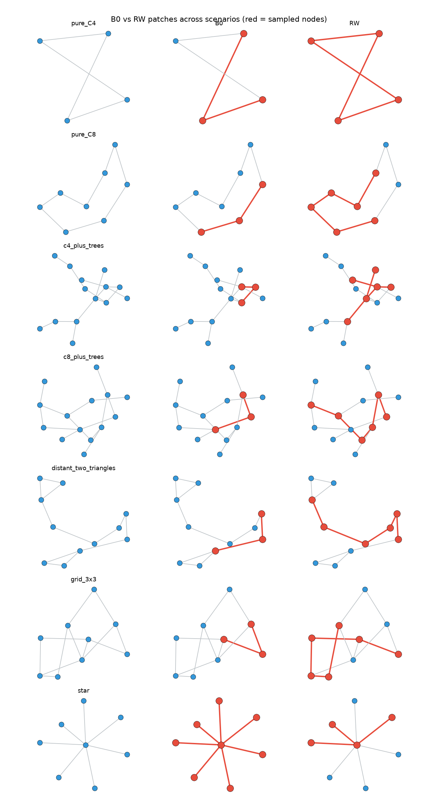

# RW vs B0 patch visualization

Red nodes = sampled set S; gray/blue = rest of graph.

| scene | B0 |S| | B0 has C4 | RW |S| | RW has C4 | fig |
|-------|------|-----------|------|-----------|-----|
| pure_C4 | 3 | False | 4 | True | `pure_C4.png` |
| pure_C8 | 3 | False | 6 | False | `pure_C8.png` |
| c4_plus_trees | 3 | False | 6 | False | `c4_plus_trees.png` |
| c8_plus_trees | 3 | False | 6 | False | `c8_plus_trees.png` |
| distant_two_triangles | 3 | False | 6 | False | `distant_two_triangles.png` |
| grid_3x3 | 3 | False | 6 | False | `grid_3x3.png` |
| star | 8 | False | 4 | False | `star.png` |

Expected: on pure_C4 / c4_plus_trees, B0 often **no** C4 in induced patch; RW with m≥4 often **yes**.

